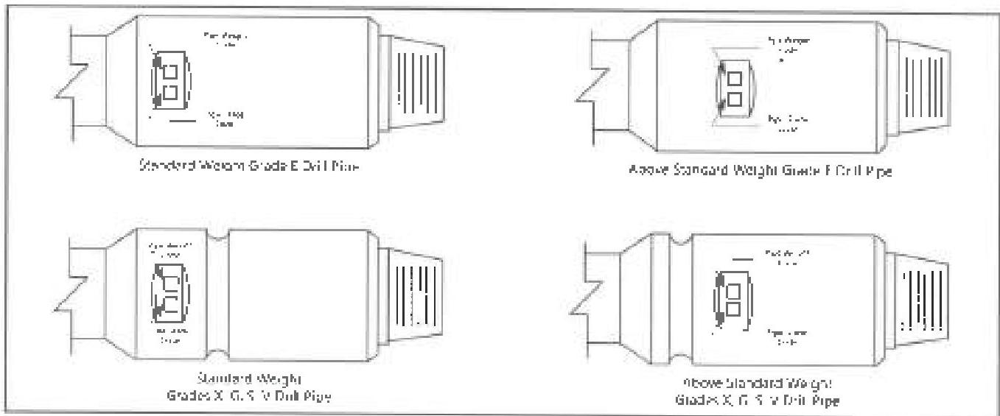
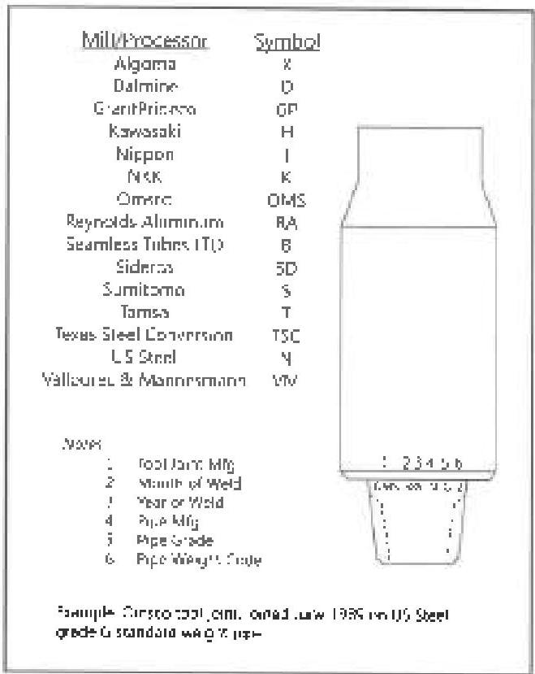
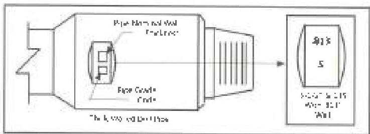

Figure 3.11.1a Marking system for normal weight drill pipe.

|  OD (in) | Nom Wr (lb/ft) | Weight Code  |
| --- | --- | --- |
|  3-3/8 | 4.85 | 1  |
|   |  6.65 (Standard) | 2  |
|  2-7/8 | 6.85 | 1  |
|   |  10.40 (Standard) | 2  |
|  3-1/2 | 9.50 | 1  |
|   |  13.30 (Standard) | 2  |
|   |  15.50 | 3  |
|  4 | 11.85 | 1  |
|   |  14.00 (Standard) | 2  |
|   |  15.70 | 3  |
|  4-1/2 | 23.75 | 1  |
|   |  26.50 (Standard) | 2  |
|   |  29.00 | 3  |
|   |  22.82 | 4  |
|   |  25.66 | 5  |
|   |  25.50 | 6  |
|  5 | 16.25 | 1  |
|   |  19.50 (Standard) | 2  |
|   |  25.60 | 3  |
|  5-1/2 | 19.20 | 1  |
|   |  21.90 (Standard) | 2  |
|   |  24.70 | 3  |
|  5-7/8 | 23.40 | 2  |
|   |  26.30 | 3  |
|  6-5/8 | 25.20 (Standard) | 2  |
|   |  27.70 | 3  |

Figure 3.11.1b Weight codes.

|  Grade | Grade Code  |
| --- | --- |
|  E-25 | E  |
|  X-95 | X  |
|  G-135 | G  |
|  S-135 | S  |
|  DS-140 | Z*  |
|  V | V*  |

Figure 3.11.1c Grade codes.
"Z and V are to be used unless the manufacturer has a different marking indicating the grade

Figure 3.11.1d API on neck marking system.
Figure 3.11.1e New marking system for thick-walled drill pipe