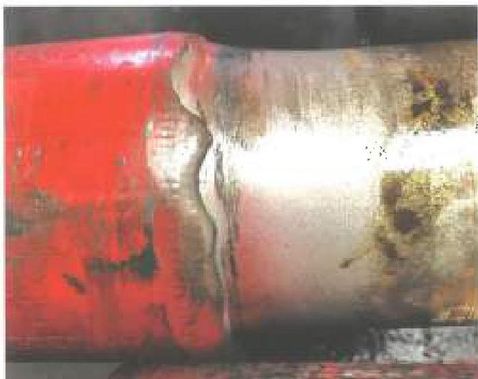
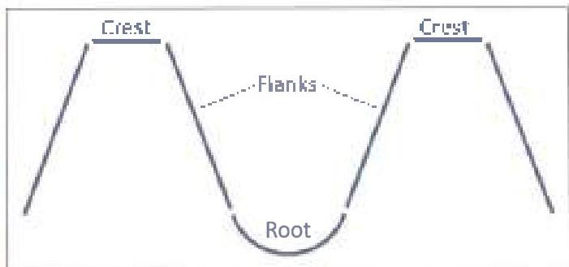

do not extend into base metal. For non-magnetic connections, pay close attention to the thread roots at the back of the box and the boreback surface. These surfaces shall be free of cracks or crack like indications. Grinding to remove cracks is not permissible.

d. The minimum illumination level at the inspection surface shall be 50 foot-candles. Visual acuity requirements shall be per section 2.20.2. Light intensity level at the inspection surface must be verified:

- At the start of each inspection job
- When light fixtures change positions or intensity.
- When there is a change in relative position of the inspected surface with respect to the light fixture.
- When requested by the customer or its designated representative
- Upon completion of the inspection job.

The requirements do not apply to direct sunlight conditions. If adjustments are required to the light intensity level at the inspection surface, all components inspected since the last light intensity level verification shall be re-inspected.

e. Air Wash: Air wash on the tool joint tapers (erosion caused by particle flow during air drilling, an example is shown in Figure 3.11.2) that covers more than 30% of the circumference of the tool joint taper shall be cause for rejection. Grinding to repair the air washed area is not permitted.

f. Thread Compound and Protectors: Acceptable connections shall be coated with an acceptable tool

Figure 3.11.2 Example of rejectable air wash on tool joint taper.

joint compound over all thread and shoulder surfaces, including the end of the pit. Thread protectors shall be applied and secured with approximately 50 to 100 ft-lb of torque. The thread protectors shall be free of debris. If additional inspection of the threads or shoulders will be performed prior to pipe movement, the application of thread compound and protectors may be postponed until completion of the additional inspection.

### 3.11.5 APL and Similar Non-Proprietary Connections

In addition to the requirements of paragraph 3.11.4, API and similar non-proprietary connections shall meet the following requirements.

### 3.11.5.1 Bevel Width

An approximate 45 degree OD bevel at least 1/32 inch wide shall be present for the full circumference on both pin and box.

### 3.11.5.2 Thread Root and Surface Pitting

This criteria covers tool joint (NWDP and TWDP) connections. See Figure 3.11.3 for the thread features considered.

a. Pin Connections: No pitting is allowed in the roots of any threads that are within 1-1/2 inches from the last scratch. Pitting is allowed in other thread sorts, as well as all thread flanks and crests, as long as pitting does not occupy more than 1-1/2 inches in length along any thread helix, the pit depth does not exceed 1/32 inch, and the pit diameter does not exceed 1/8 inch.

b. Box Connections: Pitting on all thread surfaces shall not occupy more than 1-1/2 inches in length along any thread helix, the pit depth shall not exceed 1/32 inch, and the pit diameter shall not exceed 1/8 inch.

c. Locating the Last Scratch: Figure 3.11.4 shows an example API pin connection. The last scratch is created by the machining insert as it is slowly pulled

Figure 3.11.3 Parts of thread forms.