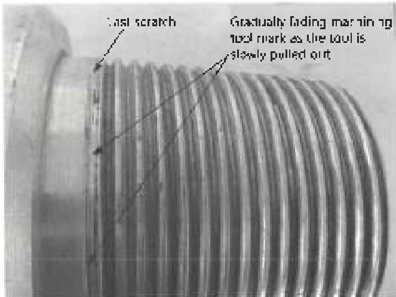
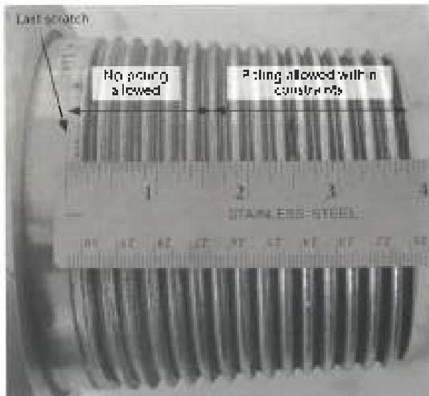
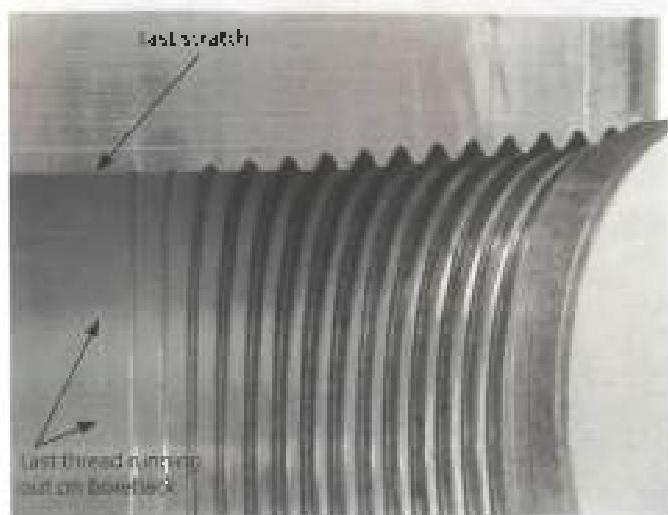

out, leaving an imperfect thread at the back of the connection. To locate the last scratch, rotate the connection until the last mark made by the machining insert is visible.

d. Measuring Required Distance: Measure 1-1/2 inches as shown in Figure 3.11.5. Threads on the connection follow the thread helix. Consequently, there will be areas where some of the thread root may fall within 1 1/2 inches while some of the thread root may theoretically be outside of 1 1/2 inches from the last scratch. In such cases, no pitting is allowed on that thread root even on the portions that may theoretically be outside of 1-1/2 inches from the last scratch. This is evident in Figure 3.11.5 where line marked "no pitting allowed" is extended slightly beyond 1-1/2 inches (till the crest of the next thread) in order to ensure the entire thread root.

## 3.11.5.3 BHA Connections with Stress Relief Features (SRF)

This criteria covers BHA connections with Stress Relief Features (SRF). No pitting is allowed in the roots of any threads that are within 1-1/2 inches from the last scratch. Pitting is allowed in other thread roots as long as the pitting does not occupy more than 1 1/2 inches in length along any thread helix, the pit depth does not exceed 1/32 inch, and the pit diameter does not exceed 1/8 inch. For pitting allowance on SRFs, see paragraph 3.11.5.4.

a. Locating the Last Scratch: Figure 3.11.6 shows an example API box connection with SRF (longitudinally split for clear view of internal geometry). The last scratch is created by the machining insert on the box connections with SRF due to machining of the boreback. The boreback creates truncated threads at the back of the box with gradually reducing height. The last thread eventually runs out at the boreback creating a last scratch. To locate the last scratch, rotate the connection until the last thread runs out on the boreback is visible. Figure 3.11.7 shows an example API pin connection with SRF. The last scratch is created by the intersection of the machined radius of the SRF with the flank of the last thread. To locate the last scratch, rotate the connection until the mark made from machining the radius is visible as shown in Figure 3.11.7.

b. Measuring Required Distance: Measure 1-1/2 inches as shown in Figures 3.11.8 and 3.11.9. Threads on the connection follow thread helix. Consequently, there

Figure 3.11.4 Identifying last scratch on drill pipe pin connection without SRF

Figure 3.11.5 Measuring 1-1/2 inches from last scratch on drill pipe pin connection without SRF

Figure 3.11.6 Locating the last scratch on BHA box connection with SRF