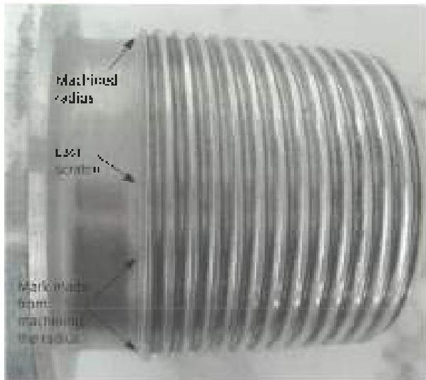
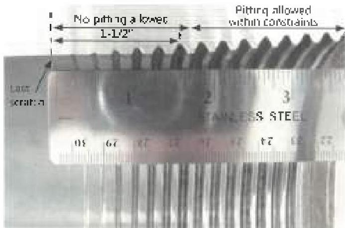
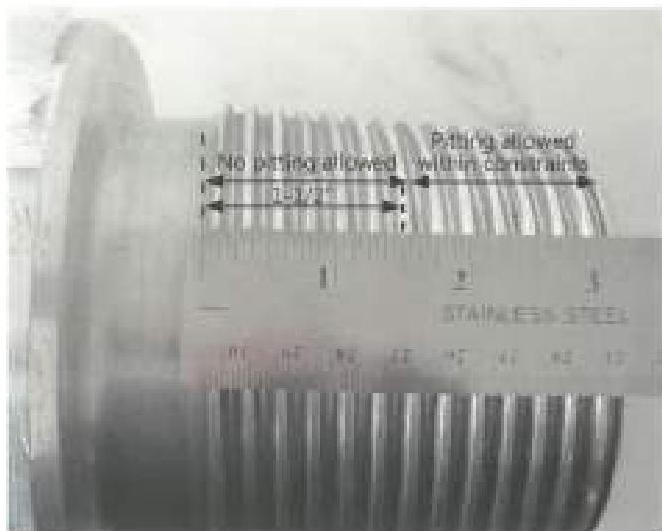
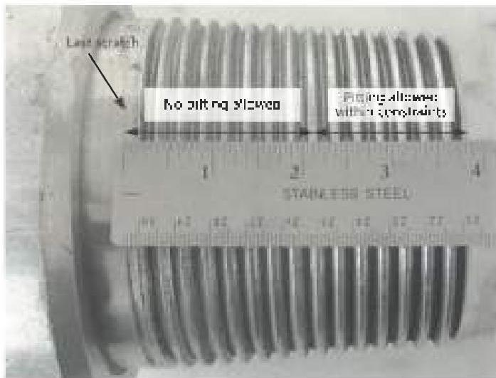

Figure 3.11.7. Lucating the last scratch on BHA pin connection with SRF.

Figure 3.11.8. Measuring 1 1/2 inches from the last scratch on BHA box connection with SRF.

will be areas where some of the thread root may fall within 1-1/2 inches while some of the thread root may theoretically be outside of 1-1/2 inches from the last scratch. In such cases, no pitting is allowed on that thread root even on the portions that may theoretically lie outside of 1-1/2 inches from the last scratch. This is evident in Figure 3.11.8 and Figure 3.11.9 where line marked "no pitting allowed" is extended slightly beyond 1 1/2 inches (fill the crest of the next thread) to cover the entire thread root.

## 3.11.5.4 BHA Connections Without SRF

This criteria covers BHA connections without SRFs. No pitting is allowed in the roots of any pin threads that are within 2 inches from the last scratch. Pitting is allowed in other pin thread roots and all box thread roots within constraints specified below. Pitting shall not occupy more than 1-1/2 inches in length along any thread helix, the pit depth shall not exceed 1/32 inch, and the pit diameter shall not exceed 1/8 inch.

a. Lucating the Last Scratch: Refer to section 3.11.5.2c.

b. Measuring Required Distance: Measure 2 inches as shown in Figure 3.11.10. Threads on the connection follow thread helix. Consequently, there will be areas where some of the thread root may fall within 2 inches while some of the thread root may theoretically be outside of 2 inches from the last scratch. In such cases, no pitting is allowed on that thread root even on the portions that may theoretically lie outside of 2 inches from the last scratch. This is evident in Figure 3.11.10 where line marked "no pitting allowed" is extended

Figure 3.11.9. Measuring 1-1/2 inches from the last scratch on BHA pin connection with SRF.

Figure 3.11.10. Measuring 2 inches from the last scratch on BHA pin connection without SRF.