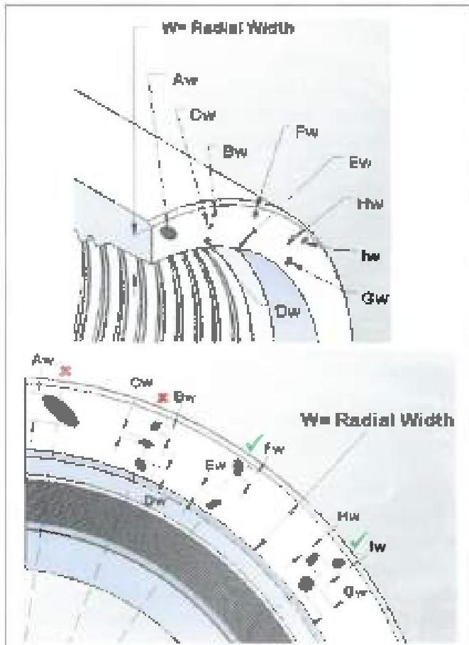

# 3.11.5.15 Shoulder Flatness

Box shoulder flatness shall be verified by placing a straightedge across a diameter of the tool joint face and rotating the straightedge at least 180 degrees along the plane of the shoulder. Any visible gaps shall be cause for rejection. The procedure shall be repeated on the pin with the straightedge placed across a chord of the shoulder surface. Any visible gaps between the straightedge and the shoulder surface shall be cause for rejection.

# 3.11.6 HI TORQUE™, eXtreme™ Torque, uXT™, eXtreme™ Torque-M, TurboTorque™, TurboTorque-M™, Grant Prideco Double Shoulder™, and uGPDS™

In addition to the requirements of paragraph 3.11.4, Grant Prideco HI TORQUE™ (HT), eXtreme™ Torque (XT), uXT™, eXtreme™ Torque-M (XT-M), TurboTorque™ (TT), TurboTorque-M™ (TT-M), Grant Prideco Double Shoulder™ (GPDS), and uGPDS™ connections shall meet the following requirements.

Note: Damages include, but are not limited to, the following conditions: galls, nicks, washes, fins, dents, scratches, pits, or cuts. This does not include discoloration or other superficial anomalies that alter the appearance only. When conflicts arise between this specification and the manufacturer's requirements, the manufacturer's requirements shall apply.

a. Preparation: All thread, make-up shoulder, and seal surfaces shall be cleaned sufficiently to allow for visual inspection. For XT™, uXT™, XT-M™, TT™, and TT-M™ the starting threads of the pin and box connections should be cleaned using a "soft wheel" or other buffing method.

b. Primary Shoulder (Seal): The seal surfaces shall be free of raised metal in corrosion deposits detected visually or by rubbing a metal scale or fingernail across the surface. Any pitting or interruptions of the seal surface that are estimated to exceed 1/32 inch in depth or cumulatively cover more than 1/3 of the radial width at any given location are rejectable. No filing of the seal shoulders is permissible. See Figure 3.11.11 for examples of acceptable and rejectable damages.

c. Secondary Shoulder (Mechanical Stop): The Secondary Shoulder is not a sealing surface. Damage to this surface is not critical unless the damage interferes with the make-up, driftability, or torque capacity of the connection. Dents, scratches, and cuts are not acceptable if they exceed 1 inch in length along the circumference or cause the connection to be rejected due to shortening of the shoulder to shoulder length.

Any metal protrusion above the seal surface is not acceptable and shall be removed by filling, soft wheel, or other buffing method and protected by applying coating to the repaired areas. Connection length readings shall not be taken in damaged areas.

d. Refacing: For HT™, XT™, uXT™, TT™, GPDS™, and uGPDS™, if refacing is necessary, the distance from the primary shoulder to the secondary shoulder must be maintained as required in the Dimensional 2 Inspection. Refacing limits are 1/32 inch on any one removal and 1/16 inch cumulatively. If existing benchmarks indicate that the shoulder has been refaced beyond the maximum, the connection shall be rejected.

Figure 3.11.11 Acceptable and rejectable seal damage

|  Acceptable Damage | Rejectable Damage  |
| --- | --- |
|  $E_{a} + E_{b} \leq \frac{W}{3}$ | $A_{a} > \frac{W}{3}$  |
|  $G_{a} + I_{a} \leq \frac{W}{3}$ | $B_{a} + C_{a} + D_{a} > \frac{W}{3}$  |