- GPMark™ Benchmark: After refacing repair, a minimum length of 1/16 inch (0.062 inch) shall remain on the box refacing benchmark, and 3/16 inch maximum (0.188 inch) shall remain on the pin refacing benchmark. Rethreading is required if excess material is removed. See Figure 3.11.12a.

- Xmark™ Benchmarks: After refacing repair, a visible step on the benchmark shall remain on the primary shoulder. The step is a necessary indicator that a benchmark is still present. Rethreading is required if there is no visible benchmark. See Figure 3.11.12b.

Machine refacing in a lathe is the preferred method. Portable field refacing units designed specifically for Grant Pridcon connections are acceptable. A minimum of four measurements shall be taken when using a portable field refacing unit. The variability of face flatness and squareness that is introduced should be monitored. If any measurement is found to be

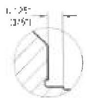

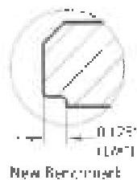
Figure 3.11.12a GPMark™ Benchmarks.

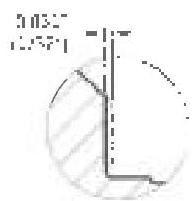

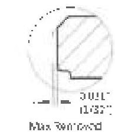
Max Removed per Reface

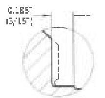

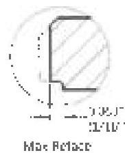

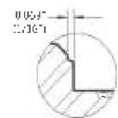

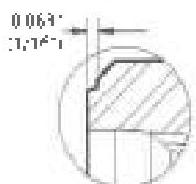
Figure 3.11.12b Xmark™ Benchmarks.

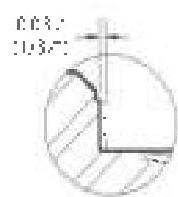

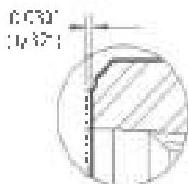
Single Reface

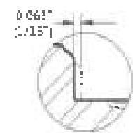

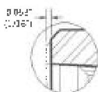
Max Reface (or invisible step)

outside the drawing limits, the connection shall be rejected.

e. Threads: Thread flank surfaces shall be free of damage that exceeds 1/16 inch in depth or 1/8 inch in diameter/width. For damage that is not round, the 1/8 inch requirement applies to the width of the damage, and shall not apply to the length of the damage along the circumference. See Figure 3.11.12c. Material that protrudes beyond the thread profile shall be removed using a round centered triangle hand file or soft buffing wheel. Any damage in the thread must be local within the Pit Free Zone designated on the "Field Inspection Dimensions" drawing, latest revision, is not acceptable. For thread roots outside the designated Pit Free Zone, damage that exceeds 1/32 inch in depth or 1/8 inch in diameter is not acceptable and shall be repaired by rethreading.

Note. For $XT^{TM}$, $uXT^{TM}$, $XTM^{TM}$, $TT^{TM}$, and $TT-M^{TM}$ connections, the stub flank to crest radius of the starting 5 threads round off during break-in and normal operation. This condition is normal and does not affect the service of the connection. Thread flank surfaces that contain damage exceeding 1/16 inch in depth or 1/8 inch in diameter are acceptable in these first 5 starting threads.

f. Thread Profile: The thread profile shall be verified along the full length of complete threads in two locations at least 90 degrees apart. The profile gage shall mesh evenly in the threads and show normal contact. If the profile gage does not mesh evenly in the threads, lead measurements shall be taken.

g. Lead: For $HT^{TM}$, $XT^{TM}$, $uXT^{TM}$, $XT-M^{TM}$, $GPDS^{TM}$, and $uGPDS^{TM}$, if the profile gage indicates that thread

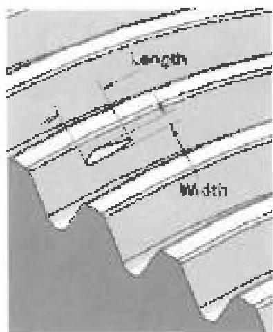
Figure 3.11.12c Dimensions of damage on thread flanks.