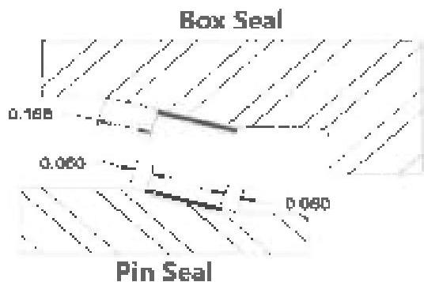

stretch has occurred, lead shall be measured over a 2-inch interval. Thread stretch shall not exceed 0.006 inch over the 2-inch length. Connections failing this inspection should be inspected for cracks and, if none are found, re-threaded.

For Grant Prideco TT™ and TT-M™, if the profile gage indicates that thread stretch has occurred, both thread leads shall be verified individually (in lead) and jointly (between leads). Connections failing the below inspections shall be inspected for cracks and if none are found, re-threaded.

## Three Threads per Inch (3 TPI)

- The first lead shall be measured over 6 threads (2 inch intervals) and shall not exceed 0.006 inch.
- By advancing one thread, the second thread lead shall be measured over 6 threads (2 inch interval) and shall not exceed 0.006 inch.
- Joint thread leads shall be measured over a 3 threads (1 1/2 inch interval) and shall not exceed 0.005 inch.

## Three and a Half Threads per Inch (3.5 TPI)

- The first lead shall be measured over 4 threads (1 inch interval) and shall not exceed 0.003 inch.
- By advancing one thread, the second thread lead shall be measured over 4 threads (1 inch intervals) and shall not exceed 0.003 inch.
- Joint thread leads shall be measured over 7 threads (2 inch interval) and shall not exceed 0.006 inch.

h. Coating: Threads and shoulders that are repaired by filing or sefacing must be phosphate coated or copper sulfate coated.

i. Dimensional: Dimensional 2 (Section 3.13.5 or 3.13.6, as applicable) is required for drill pipe connections and Dimensional 3 (Section 3.14.5 or 3.14.6, as applicable) is required for HWDP, drill collar, and sub connections.

## 3.11.7 XT-M™ and TT-M™

In addition to the requirements of paragraph 3.11.6, Grant Prideco XT-M™ and TT-M™ connections shall meet the following requirements.

a. 15" Seal: The 15" metal-to-metal sealing surfaces are allowed to contain non-circumferential damage that is less than or equal to 1/32 inch in length, width, diameter, or depth. Multiple pits of this type are acceptable provided there is at least 1 inch circumferential separation between them. Circumferential lines or marks are acceptable in this surface provided they cannot be detected by rubbing a fingernail across the surface. The following "Pin Seal" and "Box Seal" diagrams (Figure 3.11.13) show areas of the seal that may contain damage exceeding that previously stated in this procedure. The area of the pin seal within 0.060 inch of the minor pin nose diameter is a not-contact surface and damage in this area does not affect sealing. The area on the pin seal within 0.060 inch of the major pin nose diameter may also contain damage or pitting. Damages and pitting within these two areas of the pin seal are permissible provided the balance of the pin seal contact surface area meets the requirements of this procedure. Similarly, the area on the box seal within 0.188 inch of the major box cylinder diameter contains the non-contact portion of the box seal and that portion of the seal that corresponds to the first 0.060 inch of the pin seal. Damage and pitting within this area of the box seal are permissible provided the balance of the box seal contact surface area meets the requirements of this section. Any metal protrusion above the seal surface is not acceptable. Filing is not permitted on any area of the radial metal-to-metal seal.

b. Refacing: The field refacing method addressed in 3.11.6d does not apply to the XT-M™ and TT-M™ connection, which require shop redressing in a licensed Grant Prideco facility.

## 3.11.8 Grant Prideco Express™, Grant Prideco EIS™, and Grant Prideco TM2™

The connections may be abbreviated as follows: Grant Prideco Express as VX™, Grant Prideco EIS as EIS™, and Grant Prideco TM2 as TM2™. In addition to the Visual Connection requirements of paragraph 3.11.4, VX™, EIS™, and TM2™ connections shall meet the following requirements.

Figure 3.11.13 XT-M™ and TT-M™ box and pin seal surfaces.