joint shall be placed back into service prior to performing any additional refacing repair.

- The cumulative total material removal from the primary make-up shoulder for all refacing operations shall not exceed 3/32 inch before rethreading is required.
- Repair by refacing methods shall only remove sufficient material to repair the damage. However, when damage is less than 1/32 inch deep, all damage shall be removed from the primary make-up shoulder.
- After the maximum reface allowance is met, any remaining damage on the primary make-up shoulder shall not be deeper than 1/64 inch and shall meet all other requirements of this procedure.
- If the connection cannot be brought back within the acceptable limits outlined in this procedure without removing more than 1/32 inch of material from the primary shoulder, then rethreading shall be required.
- Both the primary make-up shoulder and secondary make-up shoulder shall be skimmed/machined during a refacing operation for all double-shoulder connections.
- Machine refacing in a lathe is the preferred method.
- If the portable field refacing unit method is used, variability in the face flatness and squareness that is introduced shall be monitored by taking the connection length measurements in a minimum of four locations, equally spaced around the circumference. Each measurement shall be within the limits of the "Field Inspection Dimensions" drawing, latest revision.
- GPMark™ Benchmark: After refacing repair, a minimum length of 1/16 inch (0.063 inch) shall remain on the box refacing benchmark, and 3/16 inch maximum (0.188 inch) shall remain on the pin refacing benchmark. Rethreading is required if excess material is removed. See Figure 3.11.14.
- Xmark™ Benchmarks: After refacing repair, a visible step on the benchmark shall remain on the primary shoulder. The step is a necessary indication that a benchmark is still present. Rethreading is required if there is no visible benchmark. See Figure 3.11.15.

c. Threads: Thread surfaces shall be free of any raised metal protruding above the thread surface that cannot be removed by filing, soft wheel, or other baffling method (filing is not permitted in the thread roots). Any repaired areas shall be protected by applying an acceptable coating. Thread flask surfaces shall be free of damage that exceeds 1/16 inch in depth or 1/8 inch in diameter/width. For damage that is not round, the 1/8 inch requirement applies to the width of the damage, and shall not apply to the length of the damage along the circumference. See Figure 3.11.12c. Thread roots within the Pit Free Zone designated on the "Field Inspection Dimension" drawing, latest revision, shall be free of all damage. For thread roots outside of the designated Pit Free Zone, damage shall not exceed 1/32 inch in depth or 1/8 inch in diameter.

f. Thread Profile: The thread profile shall be verified along the length of the full form threads in two locations at least 90 degrees apart. The profile gauge shall

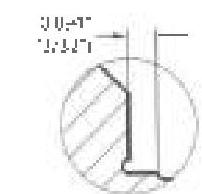

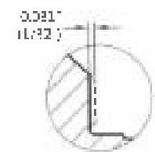

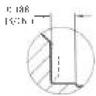

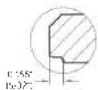
New Benchmark

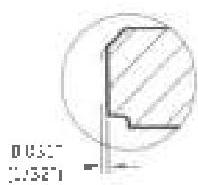
Max Removed
pin Reface

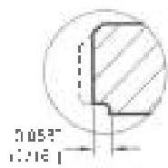
Max Retard

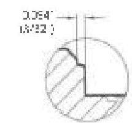
Figure 3.11.14 Refacing with the GPmark™ Benchmark for Delta™ connections.

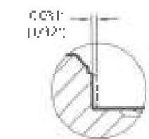

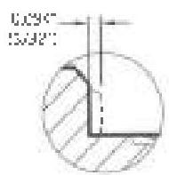

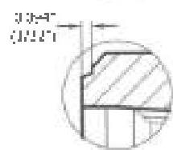
New Benchmark

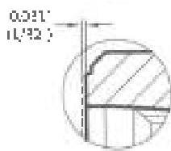
Max Removed
pin Reface

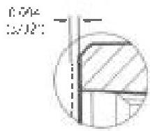
Max Retard
Figure 3.11.15 Refacing with the Xmark™ Benchmark for Delta™ connections.

61