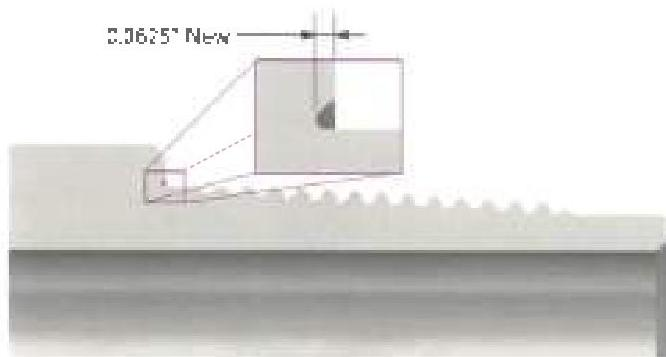
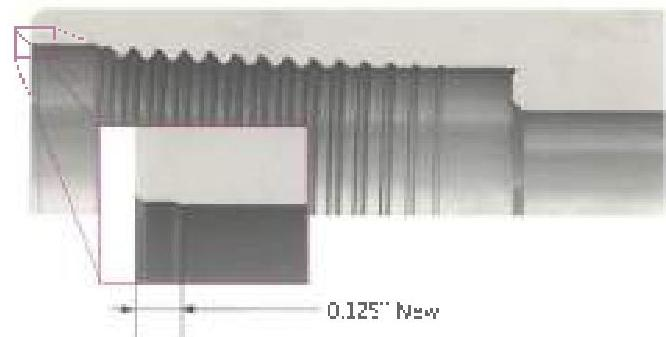

mesh evenly in the threads and show normal contact. If the profile gauge does not mesh in the threads, lead measurements shall be taken.

g. Lead: If the profile gauge indicates that thread stretch has occurred, lead shall be measured over a 2-inch interval. Thread stretch shall not exceed 0.006 inch over the 2-inch length. Connections failing this inspection should be required by rethreading.

h. Coating: Threads and shoulders that are repaired by filing or refacing shall be protected by hot phosphate coating, or by using copper sulfate or other commercially available effective surface etchant products suitable for rotary shoulder connections. All rethreaded connections shall be protected by hot phosphate coating.

i. Dimensional: Dimensional 2 (Section 3.13.12) is required for drill pipe connections and Dimensional 3 (Section 3.14.8) is required for HWDP, drill collar, and sub connections.

## 3.11.14 Grant Prideco X-Force™

In addition to the Visual Connection requirements of paragraph 3.11.4, Grant Prideco X-Force™ (XF) connections shall meet the following requirements.

**Note:** When conflicts arise between this specification and the manufacturer's requirements, the manufacturer's requirements shall apply.

a. Preparation: All thread, make-up shoulder, and seal surfaces shall be cleaned sufficiently to allow for visual inspection.

b. Bevel Width: An approximate 45 degree OD bevel at least 1/32 inch wide shall be present for the full circumference on both pin and box.

c. Box Swell: A straightedge shall be placed along the longitudinal axis of the box tool joint. If a visible gap exists between the straightedge and the tool joint, the OD must be measured using calipers. Compare the OD at the bevel to the OD 2 inches, ±1/2 inch away from the bevel. If the OD at the bevel is greater by 1/32 inch or more, the connection shall be rejected.

d. Primary Shoulder (Seal): Any pitting, interruptions, galls, nicks, washes, fins, or other conditions on the seal surface that are estimated to exceed 1/32 inch in depth or occupy more than 30% of the seal width at any given location are rejectable. No filing of the seal shoulders is permissible.

e. Secondary Shoulder (Mechanical Stop): The secondary shoulder is not a seal. This shoulder must be free of raised metal or other imperfections that could prevent proper make-up, driftability, or cause galling. Secondary shoulder damage can be repaired with a hand file which should be used to remove protruding metal.

f. Relacing: If refacing is necessary, the distance from the primary shoulder to the secondary shoulder must be maintained as required in the Dimensional 2 Inspection. Shoulder relacing must be performed in a machine repair shop. Refacing limits are 1/32 inch on any one removal and 1/16 inch cumulatively. If existing benchmarks indicate that the shoulder has been refaced beyond the maximum, the connection shall be rejected. Drill pipe machined with X-Force™ design have benchmark on pin and box external shoulders to check whether the connector can be re-faced or not. As shown in Figure 3.11.16, pin benchmark is a groove cut inside the external shoulder that has the same depth as allowed re-facing depth (1/16 inch). When the pin benchmark is no

Figure 3.11.16 Pin end benchmark for X-Force™ connection

Figure 3.11.17 Box end benchmark for X-Force™ connection