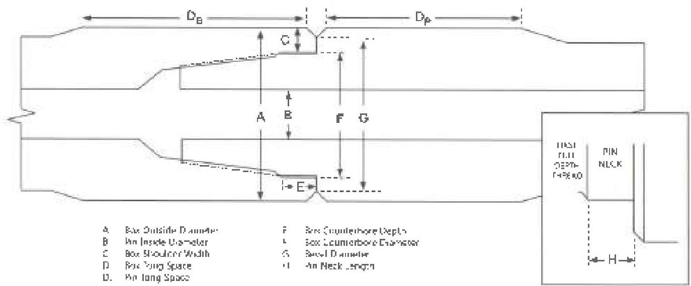

# 3.13.4 Procedure and Acceptance Criteria for API and Similar Non-Proprietary Connections

These features are illustrated in Figure 3.13.1. It is presumed that a Visual Connection Inspection will be performed in conjunction with this inspection. If the Visual Connection Inspection will not be performed, steps 3.11.4b–c, 3.11.5.6, 3.11.5.9, and 3.11.5.10 shall be added to this procedure.

a. Box Outside Diameter (OD): The OD of the tool joint box shall be measured 3/8 inch ±1/8 inch from the shoulder. At least two measurements shall be taken spaced at intervals of 90 ±10 degrees. Box OD shall meet the requirements in Table 3.7.1, 3.7.26, or 3.8.1, as applicable.

b. Pin Inside Diameter (ID): The pin ID shall be measured under the last thread nearest the shoulder (±1/4 inch) and shall meet the requirements of Table 3.7.1, 3.7.26, or 3.8.1, as applicable.

c. Box Shoulder Width: The box shoulder width shall be measured by placing the straightedge longitudinally along the tool joint, extending past the shoulder surface, and then measuring the shoulder thickness from this extension to the counterbore (excluding any ID bevel). The shoulder width shall be measured at its point of minimum thickness. Any reading that does not meet the minimum shoulder width requirement in Table 3.7.1, 3.7.26, or 3.8.1, as applicable, shall cause the tool joint to be rejected.

d. Tong Space: Box and pin tong space (excluding the OD bevel) shall meet the requirements of Table 3.7.1, 3.7.26, or 3.8.1, as applicable. Tong space measurements on hardfaced components shall be made from the bevel to the edge of the hardfacing.

e. Box Counterbore Depth: The counterbore depth shall be measured (including any ID bevel). Counterbore depth shall not be less than 9/16 inch.

f. Box Counterbore Diameter: The box counterbore diameter shall be measured as near as possible to the shoulder (but excluding any ID bevel or rolled metal) at diameters 90 degrees ±10 degrees apart. Counterbore diameter shall not exceed the maximum counterbore dimension shown in Table 3.7.1, 3.7.26, or 3.8.1, as applicable.

g. Bevel Diameter: The bevel diameter on both the box and pin shall be within the minimum and maximum values given in Table 3.7.1, 3.7.26, or 3.8.1, as applicable.

h. Pin Neck Length: Pin neck length (the distance from the 90 degree pin shoulder to the intersection of the flank of the first full depth thread with the pin neck) shall be measured. Pin neck length shall not exceed 9/16 inch.

i. Thread Compound and Protectors: Acceptable connections shall be coated with an acceptable tool joint compound over all thread and shoulder surfaces including the end of the pin. Thread protectors shall be applied and secured with approximately 50 to 100 ft-lb of torque. The thread protectors shall be free

Figure 3.13.1 Tool joint dimensions for API and similar non-proprietary connections.