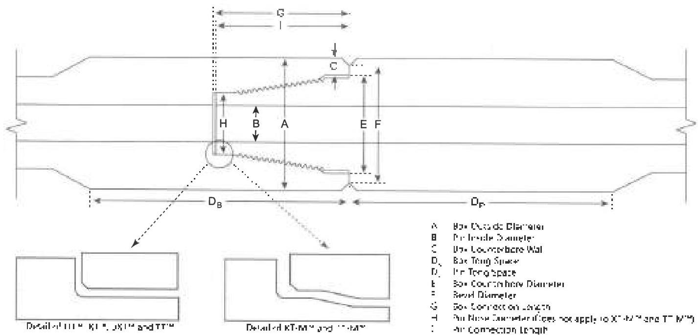

of debris. If additional inspection of the threads or shoulders will be performed prior to pipe movement, application of thread compound and protectors may be postponed until completion of the additional inspection.

## 3.13.5 Procedure and Acceptance Criteria for Grant Prideco HI TORQUE™, eXtreme™ Torque, uXT™, eXtreme™ Torque-M, TurboTorque™, and TurboTorque-M™ Connections

These features are illustrated in Figure 3.13.2. In addition to the Visual Connection requirements of 3.11.6 and 3.11.7, Grant Prideco™ HI TORQUE™, eXtreme™ Torque, uXT™, eXtreme™ Torque-M, TurboTorque™, and TurboTorque-M™ connections shall meet the following requirements.

**Note:** When conflicts arise between this specification and the manufacturer's requirements, the manufacturer's requirements shall apply.

a. Box Outside Diameter (OD): For Grant Prideco III TORQUE™ and eXtreme™ Torque-M connections, the OD of the tool joint box shall be measured at a distance of 2 inches ±1/4 inch from the primary make-up shoulder. Measurements shall be taken around the circumference to determine the minimum diameter. This minimum box diameter shall meet the requirements in Table 3.7.2, 3.7.4, or 3.8.2, as applicable.

For Grant Prideco™ eXtreme™ Torque and uXT™ sizes 43 and smaller (e.g. XT43), the OD of the tool joint box shall be measured at a distance of 5/8 inch ±1/4 inch from the primary make-up shoulder. For sizes 46 and larger, the OD of the tool joint box shall be measured at a distance of 2 inches ±1/4 inch from the primary make-up shoulder. Measurements shall be taken around the circumference to determine the minimum diameter. This minimum box diameter shall meet the requirements in Table 3.7.3, 3.7.8, 3.8.3, or 3.8.6, as applicable.

For Grant Prideco™ TurboTorque™ and TurboTorque M™ connections, the OD of the tool joint box shall be measured at a distance of 5/8 inch to 7/8 inch from the primary make-up shoulder. Measurements shall be taken around the circumference to determine the minimum diameter. This minimum box diameter shall meet the requirements in Table 3.7.6–3.7.7 or 3.8.4–3.8.5, as applicable.

b. Pin Inside Diameter (ID): The pin ID shall be measured under the last thread nearest to the shoulder (±1/4 inch) and referenced against the values in Table 3.7.2–3.7.4, 3.7.6–3.7.8, or 3.8.2–3.8.6, as applicable. The pin ID is used to define other inspection dimensions.

Figure 3.13.2 Tool joint dimensions for Grant Prideco H1 TORQUE™, eXtreme™ Torque, uXT™, X1-M™, TurboTorque™, TurboTorque M™, and Delta™ connections.