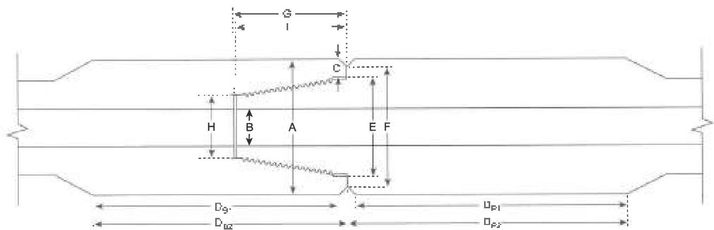

The field refacing method addressed in this procedure does not apply to the XT-M™ and T°-M™ connection or any connection with radial interference metal-to-metal seals. Such connections require shop redressing in a licensed Grant Prideco facility.

1. Refreading. This method shall be used to repair connections that fail to meet the requirements stipulated in this inspection procedure after field repair is completed. Performance of this operation requires cropping the connection behind any fatigue crack. Complete removal of the thread profile is not necessary if the connection has no fatigue cracks and if sufficient material can be removed to comply with the NEW product requirements. In this case, the connection does not have to be "reblanked," however all torque shoulders, seal surfaces and thread elements must be machined to 100% "bright metal." This is not necessary for cylindrical diameters. After refreading, the connection must be phosphate coated. Copper sulfate is not an acceptable substitute for phosphate coating on refreaded connections.

### 3.13.6 Procedure and Acceptance Criteria for Grant Prideco™ Double Shoulder and uGPDS™ Connections

These features are illustrated in Figure 3.13.3. In addition to the Visual Connection requirements of 3.11.6, Grant Prideco™ Double Shoulder and uGPDS™ connections shall meet the following requirements.

**Note:** When conflicts arise between this specification and the manufacturer's requirements, the manufacturer's requirements shall apply.

a. Tool Joint Box Outside Diameter (OD): The OD of the tool joint box shall be measured at a distance of 5/8 inch ±1/4 inch from the primary make-up shoulder. Measurements shall be taken around the circumference to determine the minimum diameter. This minimum box diameter shall meet the requirements in Table 3.7.5 or 3.7.9, as applicable.

b. Pin Inside Diameter (ID): The pin ID shall be measured under the last thread nearest to the shoulder (±1/4 inch) and referenced against the values in Table 3.7.5 or 3.7.9, as applicable. The pin ID is used to define other inspection dimensions.

c. Box Shoulder Width (also referred to as Box Counterbore (CBore) Wall Thickness): The box shoulder width shall be measured by placing the straightedge longitudinally along the tool joint, extending past the shoulder surface, and then measuring the shoulder thickness from this extension to the counterbore. The shoulder width shall be measured at its point of minimum thickness. Any reading that does not meet the minimum shoulder width

Figure 3.13.3 Tool joint dimensions for Grant Prideco Double Shoulder™, uGPDS™, Express™, EIS™, TM2™, X Force™ and Command CEF™ connections.

- Box Outside Diameter
- Box Shoulder Width
- Box Tong Space
- Box Tong Space (GPDS &amp; uGPDS)
- Pin Tong Space
- Box Counterbore Length
- Pin Nose Diameter
- Pin Counterbore Length