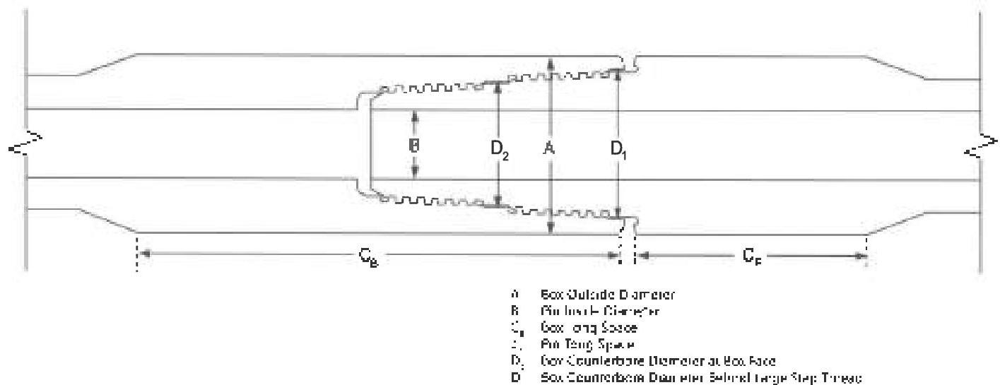

crack. Complete removal of the thread profile is not necessary if the connection has no fatigue cracks and if sufficient material can be removed to comply with the NEW product requirements. In this case, the connection does not have to be "reblanked," however all torque shoulders, seal surfaces, and thread elements must be machined to 100°/° bright metal. This is not necessary for cylindrical diameters. After rechreading, the connection must be phosphate coated. Copper sulfate is not an acceptable substitute for phosphate coating on rethreaded connections.

## 3.13.8 Procedure and Acceptance Criteria for Hydril Wedge Thread™ Connections

These features are illustrated in Figure 3.13.4. In addition to the Visual Connection requirements of 3.11.9, Hydril WT™ connections shall meet the following requirements.

Note: When conflicts arise between this specification and the manufacturer's requirements, the manufacturer's requirements shall apply.

a. Tool Joint Box Outside Diameter (OD): The OD of the tool joint box shall be measured 2 inches ±1/4 inch from the shoulder. At least two measurements shall be taken spaced at intervals of 90 ±10 degrees. Box OD measurements are for reference data only.

b. Pin Inside Diameter (ID): The pin ID shall be measured under the last thread nearest the shoulder (±1/4 inch). Pin ID measurements are for reference data only.

c. Tong Space: Box and pin tong space (excluding the OD level) shall meet the requirements of Table 3.7.20. Tong space measurements on hardfaced components shall be made from the level to the edge of the hardfacing.

d. Box Counterbore Diameter: Measure the Chore diameter at the face of the box, D₂, and the counterbore diameter immediately behind the large step thread, D₂. Measurements shall be taken at diameters 90 degrees ±10 degrees apart. Counterbore diameter shall not exceed the maximum Chore dimension shown in Table 3.7.20.

e. Thread Compound and Protectors: Acceptable connections shall be coated with an acceptable tool joint compound over all thread and shoulder surfaces including the end of the pin. Thread protectors shall be applied and secured with approximately 50 to 100 ft-ft of torque. The thread protectors shall be free of debris. If additional inspection of the thread or shoulders will be performed prior to pipe movement, application of thread compound and protectors may be postponed until completion of the additional inspection.

## 3.13.9 Procedure and Acceptance Criteria for NK DST™ Connections

These features are illustrated in Figure 3.13.5. In addition to the Visual Connection requirements in 3.11.10, NK DST™ connections shall meet the following requirements.

Note: When conflicts arise between this specification and the manufacturer's requirements, the manufacturer's requirements shall apply.

Figure 3.13.4 Tool joint dimensions for Hydril Wedge Thread™ connections