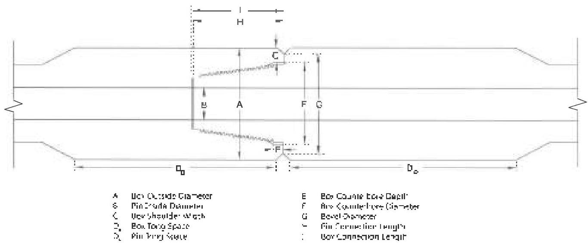

a. Box Outside Diameter (OD): The OD of the tool joint box shall be measured approximately 1 inch from the shoulder. At least two measurements shall be taken spaced at intervals of 90 ± 10 degrees. Box OD shall meet the requirements in Table 3.7.15.

b. Pin Inside Diameter (ID): The pin ID shall be measured approximately 1 inch from the shoulder and shall meet the requirements of Table 3.7.15.

c. Box Shoulder Width: The box shoulder width shall be measured by placing the straightedge longitudinally along the tool joint, extending past the shoulder surface, and then measuring the shoulder thickness from this extension to the counterbore (excluding any ID bevel). The shoulder width shall be measured at its point of minimum thickness. Any reading that does not meet the minimum shoulder width requirement in Table 3.7.15 shall cause the tool joint to be rejected.

d. Tong Space: Box and pin tong space (excluding the OD bevel) shall meet the requirements of Table 3.7.15. Tong space measurements on hardfaced components shall be made from the bevel to the edge of the hardfacing.

e. Box Counterbore Depth: The counterbore depth shall be measured (including any ID bevel). Counterbore depth shall not be less than 9/16 inch.

f. Box Counterbore Diameter: The box counterbore diameter shall be measured as near as possible to the shoulder (but excluding any ID bevel or rolled metal) at diameter 90 degrees ± 10 degrees apart. Counterbore diameter shall not exceed the maximum counterbore dimension shown in Table 3.7.15.

g. Bevel Diameter: The bevel diameter on both the box and pin shall be within the minimum and maximum values given in Table 3.7.15.

h. Pin Length: The length of the pin shall be measured using a depth micrometer and the data recorded on the inspection sheet.

i. Box Length (depth of box): The length of the box shall be measured using a depth micrometer and the data recorded on the inspection sheet. Both pin and box lengths shall meet the required min and max values in the table below.

|  Connection | Depth of Box |   | Length of Pin  |   |
| --- | --- | --- | --- | --- |
|   | Min | Max | Min | Max  |
|  DSTI NC38 | 4.404 | 4.415 | 4.395 | 4.406  |
|  DSTI NC40 | 4.915 | 4.927 | 4.907 | 4.918  |
|  DSTI NC46 | 4.915 | 4.927 | 4.907 | 4.918  |
|  DSTI NC50 | 4.915 | 4.927 | 4.907 | 4.918  |
|  DSTI S-1/2FH | 5.427 | 5.439 | 5.419 | 5.430  |

j. Shoulder Flatness: Box shoulder flatness shall be verified by placing a straightedge across a diameter of the tool joint face and rotating the straightedge at least 180 degrees along the plane of the shoulder. Any visible gaps shall be cause for rejection. The procedure

Figure 3.13.5 Tool joint dimensions for NK DST/°C correction.