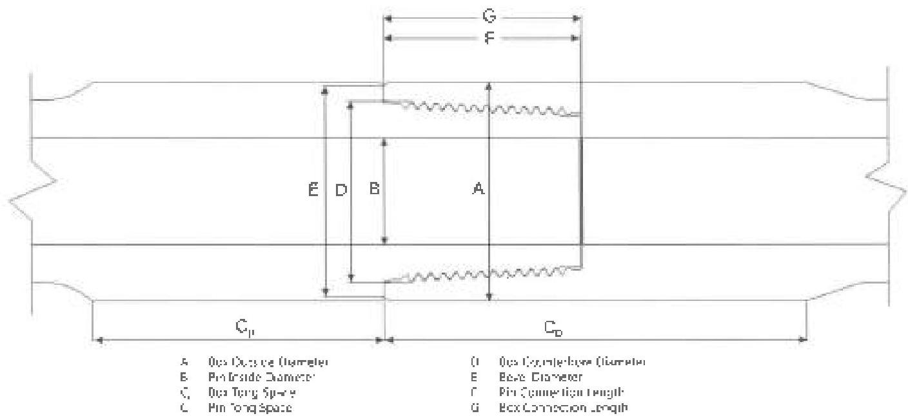

shall be repeated on the pin with the straightedge placed across a chord of the shoulder surface. Any visible gaps between the straightedge and the shoulder surface shall be cause for rejection.

k. Thread Compound and Protectors: A good connection shall be well doped with specified compound and clean thread protectors that shall be installed wrench tight and sealed. Damaged or deformed thread protectors should not be installed. All connections re-threaded or re-faced shall be phosphate or copper plated. Manganese phosphate is preferable.

3.13.10 Procedure and Acceptance Criteria for Hilong Interchangeable Double Shoulder (HLIDS™), Hilong Modified High-Torque (HLMT™), Hilong Super High Torque (HLST™), and Hilong Improved Super High-Torque (HLIST™) Connections

These features are illustrated in Figure 3.13.6. In addition to the Visual Connection requirements of 3.11.11, HLIDS, HLMT, HLST, and HLIST connections shall meet the following requirements.

Note. When conflicts arise between this specification and the manufacturer's requirements, the manufacturer's requirements shall apply.

a. Box Outside Diameter (OD): The OD of the tool joint box shall be measured at a distance of 5/8 inch ±1/4 inch from the primary make-up shoulder. Measurements shall be taken around the

circumference to determine the minimum diameter. This minimum box diameter shall meet the requirements in Table 3.7.16, 3.7.19, as applicable.

b. Pin Inside Diameter (ID): The pin ID shall be measured under the last thread nearest the shoulder (±1/4 inch) and shall meet the requirements in Table 3.7.16–3.7.19, as applicable.

c. Tong Space: Box and pin tong space (including the OD bevel) shall meet the requirements of Table 3.7.16–3.7.19, as applicable. Tong space measurements on hardfaced components shall be made from the primary shoulder face to the edge of the hardfacing.

d. Box Counterbore Diameter: The box counterbore diameter shall be measured and shall meet the requirements shown in Table 3.7.16, 3.7.19, as applicable.

e. Bevel Diameter: The bevel diameter on both the box and pin shall be measured and shall meet the requirements shown in Table 3.7.16, 3.7.19, as applicable.

f. Pin Connection Length: The distance between the primary and secondary make-up shoulders shall be measured in two locations, 180 degrees apart, and free from mechanical damage. This distance shall meet the requirements of Table 3.7.16, 3.7.19, as applicable. If the connection length exceeds the specified criteria,

Figure 3.13.6 Tool joint dimensions for Hilong HLIDS, HLMT, HLST, and HLIST connections.