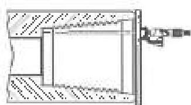
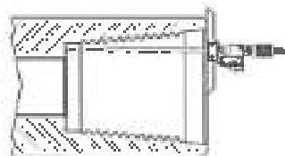
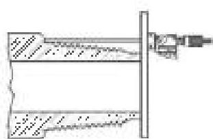
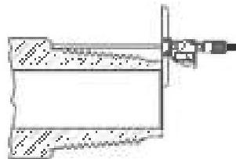

b. Pin Inside Diameter: Visually check the inside diameter for wear, erosion, or other conditions affecting the diameter. Measure the inside diameter with the calipers at any area of the inside diameter increase and under the last thread nearest the shoulder (+1/4 inch). The pin inside diameter must meet the requirements in Tables 3.7.21-3.7.24, as applicable.

c. Minimum Counterbore Wall: The box counterbore wall thickness shall be measured by placing the straightedge longitudinally along the tool joint, extending past the shoulder surface and then measuring the wall thickness from this extension to the counterbore. The counterbore wall thickness shall be measured at its point of minimum thickness. The box counterbore wall thickness must meet the requirements in Tables 3.7.21-3.7.24, as applicable.

d. Tong Space: There is a minimum tong space (including the OD bevel) requirement of 6 inches for pins and a minimum box tong space equal to the connection length +1 inch or 8 inch minimum, whichever is greater. Tong space measurements on hardfaced components shall be made from the primary shoulder to edge of the hardfacing. The box and pin tong space must meet the requirements in Tables 3.7.21-3.7.24.

e. Box Counterbore Diameter: The inside diameter of the box counter bore shall be verified. The counterbore diameter has to be measured at two places approximately 90 degrees apart. The measurement is made from the projected intersection of the counter bore with the box face rather than to the internal bevel. Diameters shall not exceed the values listed in Tables 3.7.21-3.7.24, as applicable. Additionally, to test for box swell, the box counterbore diameter must not exceed the aforementioned requirements.

f. Bevel Diameter: Bevel diameter of the box and pin shall be verified to maintain adequate stresses in the connection after application of make-up torque. If the outside diameter is less than the bevel diameter, this bevel diameter is void and 1/32 inch × 45 degree taper becomes effective. The bevel diameter must meet the requirements in Tables 3.7.21-3.7.24, as applicable.

g. Box Connection Length: Measurements shall be taken using the digital depth micrometer/gauge or digital Vernier gauge fitted with a wide depth base attachment. The distance between the primary and secondary make-up shoulders shall be verified in two locations 180 degrees apart. (See Figure 3.13.8 for details.) Field re-facing is allowed but not recommended. Machine shop re-facing is preferred. Re-facing limits are the same as for repair of damaged shoulders. Both the primary seal and the secondary shoulder shall be re-faced simultaneously to ensure that proper connection length is maintained. The box connection length must meet the requirements in Tables 3.7.21-3.7.24, as applicable.

h. Pin Nose Diameter: The outside diameter of the pin nose shall be verified. To test for pin nose swell, the pin nose diameter must meet the requirements in Tables 3.7.21-3.7.24, as applicable.

i. Pin Connection Length: Measurements shall be taken using the digital depth micrometer/gauge or digital Vernier gauge fitted with a wide depth base attachment. The distance between the primary and secondary makeup shoulders shall be verified in two locations 180 degrees apart. (See Figure 3.13.9 for details.) Field re-facing is allowed but not recommended. Machine shop re-facing is preferred. Re-facing limits are the same as for repair of damaged shoulders. Both the primary seal and the secondary shoulder shall be re-faced simultaneously to ensure that proper connection length is maintained. The pin connection length must meet the requirements in Tables 3.7.21-3.7.24, as applicable.

j. Protecting Connection at Post Inspection: The connections shall be coated with storage compound after inspection to avoid corrosion unless the drill pipe is run immediately. Appropriate thread protectors that

Figure 3.13.8 Two methods of box connection length inspection

Figure 3.13.9 Two methods of pin connection length inspection.

