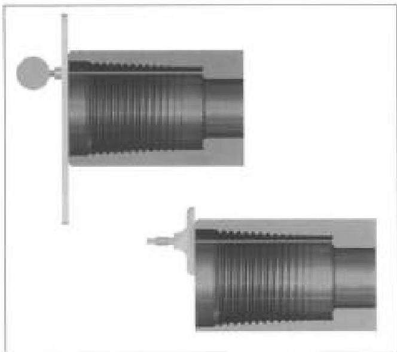
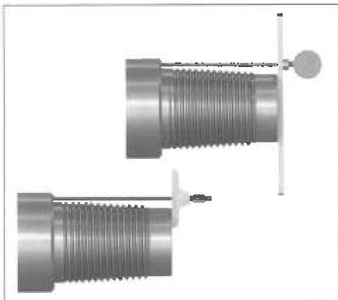

thickness. Any reading that does not meet the minimum shoulder width requirement in Table 3.7.14 shall cause the tool joint to be rejected.

d. Tong Space: Box and pin tong space shall meet the requirements of Table 3.7.14. Tong space measurements on hardfaced components shall be made from the bevel to the edge of the hardfacing.

e. Box Counterbore Diameter: The box counterbore diameter shall be measured and shall meet the requirements shown in Table 3.7.14. Since the box benchmark is a recess on the counter bore diameter of the external shoulder, be sure to measure the box end counter bore diameter and not the box benchmark diameter.

f. Bevel Diameter: The bevel diameter on both the box and pin shall be measured and shall meet the requirements shown in Table 3.7.14.

g. Box Connection Length: The distance between the primary and secondary make-up shoulders shall be measured in two locations, 90 degrees apart, and free from mechanical damage. This distance shall meet the requirements of Table 3.7.14. If the connection length exceeds the specified criteria, repair may be made by refacing the primary shoulder. If the connection length is less than the specified criteria, refacing the secondary shoulder may be adequate to repair the connection. Refacing limits are the same as that performed for damaged shoulder faces. See Figure 3.13.10.

h. Pin Nose Diameter: The outside diameter of the pin nose shall be measured and shall meet the requirements shown in Table 3.7.14.

i. Pin Connection Length: The distance between the primary and secondary make-up shoulders shall be measured in two locations, 90 degrees apart, and free from mechanical damage. This distance shall meet the requirements of Table 3.7.14. If the connection length exceeds the specified criteria, repair may be made by refacing the secondary shoulder (pin nose). If the connection length is less than the specified criteria, refacing the primary shoulder may be adequate to repair the connection. Refacing limits are the same as that performed for damaged shoulder faces. See Figure 3.13.11.

j. Thread Compound and Protectors: Acceptable connections shall be coated with an acceptable tool joint compound (or a storage compound, if applicable) over all thread and shoulder surfaces including the end of the pin. A copper-based thread compound is recommended. Only thread protectors specially designed for X-Force™ connectors may be used. These protectors cover the whole thread section and box counter bore. Sufficient grease should be applied to prevent the ingress of water into the connection. Thread protectors shall be applied and secured with approximately 50 to 100 ft. h of torque. The thread protectors shall be free of debris. If additional inspection of the threads or shoulders will be performed prior to pipe movement, application of thread compound and protectors may

Figure 3.13.10 Two methods of box connection length inspection for XF™

Figure 3.13.11 Two methods of pin connection length inspection for XF™

79