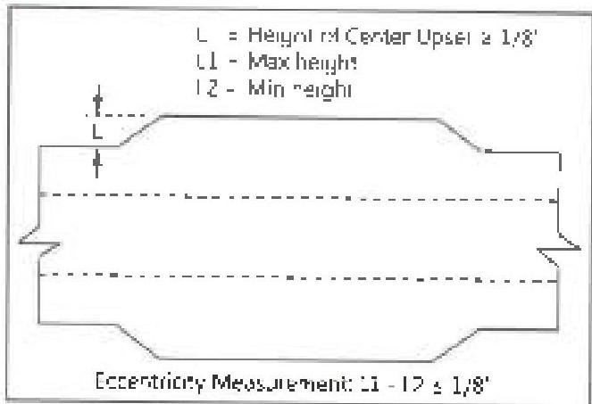
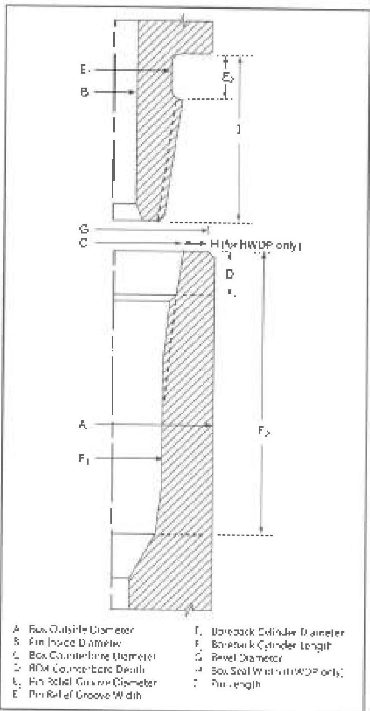

Figure 3.14.1 HWDP center upset

Figure 3.14.2 BHA connection dimensions. Connection shown with stress relief pin groove and boreback box

standards are required. See section 2.21 for calibration requirements.

## 3.14.3 Preparation

a. All products shall be sequentially numbered. Serial numbers shall be recorded and documented on all reports.

b. Connections shall be clean so that no scale, mud, or lubricant can be wiped from the thread or shoulder surfaces with a clean rag.

## 3.14.4 Procedure and Acceptance Criteria for API and Similar Non-Proprietary Connections

It is presumed that a Visual Connection Inspection will be performed in conjunction with this inspection. If the Visual Connection Inspection will not be performed, steps 3.11.4b-c, 3.11.5.6, 3.11.5.9, and 3.11.5.10 shall be added to this procedure.

a. Box Outside Diameter (OD): The OD of the box connection shall be measured 4 inches, ±1/4 inch from the shoulder. At least two measurements shall be taken spaced at intervals of 90 ±10 degrees. For HWDP, the box OD shall meet the requirements of Table 3.10.1. For drill collars, the box OD (in combination with the pin ID) shall result in a BSR within the customer's specified range. Dimensions for commonly specified BSR ranges are given on Table 3.9. BSR values for various connection types and sizes are provided in Table 3.16.

b. Pin Inside Diameter (ID): The pin ID shall be measured under the last thread nearest the shoulder ±1/4 inch. For HWDP, the pin ID shall meet the requirements of Table 3.10.1. For drill collars, the pin ID (in combination with the box OD) shall result in a BSR within the customer's specified range. Dimensions for commonly specified BSR ranges are given on Table 3.9. BSR values for various connection types and sizes are provided in Table 3.16.

c. Box Counterbore Diameter: The box counterbore diameter shall be measured as near as possible to the shoulder (but excluding any ID level or rolled metal) at diameters 90 degrees ±10 degrees apart. Counterbore diameter shall not exceed the maximum counterbore dimension shown in Table 3.9 for drill collars and Table 3.10.1 for HWDP.

d. Box Counterbore Depth: The counterbore depth shall be measured (including any ID level) on drill collars.