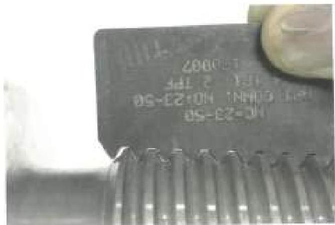
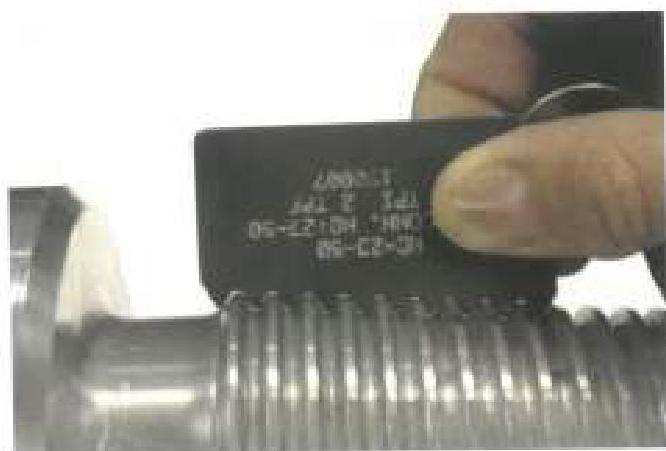
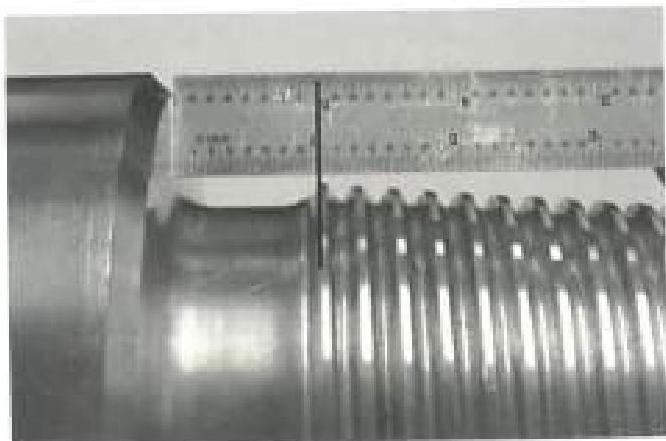

Counterhore depth shall not be less than the value shown on Table 3.9.

e. Pin Stress Relief Groove: Unless waived by the customer, all API connections NC38 and larger that make up to BHA components shall be equipped with pin stress relief grooves or they shall be rejected. The diameter and width of the API pin stress relief groove shall be measured and shall meet the requirements of Table 3.9 for drill collars and Table 3.10.1 for HWDP. The pin stress relief groove length shall be measured from the connection shoulder to the first full thread by placing a metal rule on the thread taper and squared against the connection shoulder, as depicted in Figures 3.14.3, 3.14.4 and 3.14.5. "First full thread" is defined as the thread that is closest to the pin shoulder and reaches the same height and thread profile as the second thread. The location of the first full thread can be identified by rotating the profile gage until the absolute minimum amount of light is visible between the thread form and the profile gage.

f. Box Boreback: Unless waived by the customer, all API connections NC38 and larger that make up to BHA components shall be equipped with boreback boxes or they shall be rejected. The diameter and length of the boreback cylinder shall be measured and shall meet the requirements of Table 3.9 for drill collars or Table 3.10.1 for HWDP.

g. Bevel Diameter: The bevel diameter shall be measured on both pin and box and shall meet the requirements of Table 3.9 for drill collars and Table 3.10.1 for HWDP.

h. Box Seal Width: For HWDP, box seal width shall be measured at its smallest point and shall equal or exceed the minimum value in Table 3.10.1.

i. Pin Length: For connections with pin stress relief groove, the length of the connection pin shall be measured and shall meet the requirements of Table 3.9 or 3.10.1, as applicable.

j. Pin Neck Length: For connections without pin stress relief groove, pin neck length (the distance from the 90 degree pin shoulder to the intersection of the flank of the first full depth thread with the pin neck) shall be measured. Pin neck length shall not be greater than the counterhore depth minus 1/16 inch.

k. HWDP Center Upset: The height of the center upset shall be determined by placing a straightedge along

Figure 3.14.3 Thread not fully formed as seen with light showing between profile gage and thread

Figure 3.14.4 Lay thread profile gage along thread taper and rotate around the thread form until absolute minimum light is visible between the profile gage and first thread. Thread is fully formed (First Full Thread).

Figure 3.14.5 Square scale at the point of the "First Full Thread" and take the measurement from the shoulder side of thread profile to pin shoulder

83