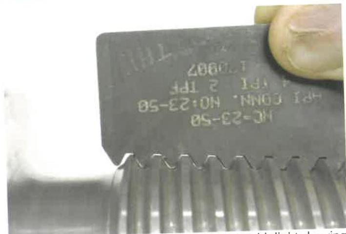
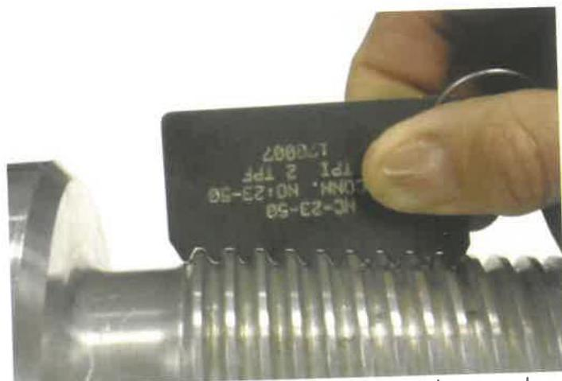
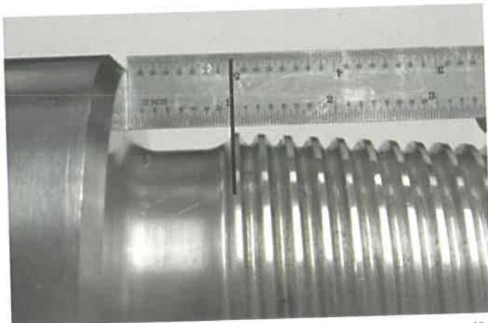

Figure 7.51 Thread not fully formed as seen with light showing between profile gage and thread.

Figure 7.52 Lay thread profile gage along thread taper and rotate around the thread form until absolute minimum light is visible between the profile gage and first thread. Thread is fully formed (First Full Thread).

Figure 7.53 Square scale at the point of the "First Full Thread" and take the measurement from the shoulder side of thread profile to pin shoulder.

box. When this occurs, specific dimensional acceptance criteria from the special sub manufacturer shall apply). The diameter and length of the boreback cylinder shall be measured and shall meet the requirements of Table 7.37 or 7.38, as applicable. On a specialty tool equipped with saver subs, end connections are the connections that join the saver subs.

g. Bevel Diameter. The bevel diameter shall be measured on both pin and box and shall meet the requirements of Table 7.37 or 7.38, as applicable.

For midbody connections, where the vendor/manufacturer controls the connection bevel diameters, material properties and makeup torque of both mating connections, if a conflict arises between this specification and the vendor/manufacturer's requirements, the manufacturer's requirements shall apply.

In this case, midbody connections are defined as any connection within the specialty tool or specialty tool BHA (which can include a number of specialty tools and crossovers between specialty tools) where the vendor/manufacturer controls the connection bevel diameters, material properties, and makeup torque of the mating connections. Specialty tool and specialty tool BHA end connections that join with other tools that the vendor/manufacturer does not control shall meet the requirements of Table 7.37 or 7.38, as applicable.

h. Box Seal Width. For components that connect to HWDP, box seal width shall be measured at its smallest and shall equal or exceed the minimum value in Table 7.38.

i. Pin Length. For connections with a pin stress relief groove, the length of the connection pin shall be measured and shall meet the requirements of Table 7.37 or 7.38, as applicable.

j. Pin Neck Length. For connections without a pin stress relief groove, pin neck length (the distance from the 90 degree pin shoulder to the intersection of the flank of the first full-depth thread with the pin neck) shall be measured. Pin neck length shall not be greater than the minimum counterbore depth specified in Table 7.37 minus 1/16 inch.

k. Tong Space. Box and pin tong space shall be measured between the shoulder bevels and the nearest diameter reduction or increase, shall exclude any hardbanding