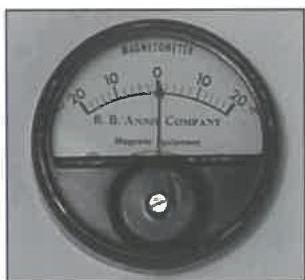

d. For wet fluorescent inspection:

- Particle concentration shall range from 0.1 to 0.4 mL/100 mL when measured using an ASTM 100 mL centrifuge tube, with a minimum settling time of 30 minutes in water-based carriers or 1 hour in oil-based carriers.
- Blacklight intensity shall be measured with an ultraviolet light meter each time the light is turned on, after every 8 hours of operation, and at the completion of the job. The minimum intensity shall be 1000 microwatts/cm² at fifteen inches from the light source or at the distance to be used for inspection, whichever is greater.
- The intensity of ambient visible light, measured at the inspection surface during wet fluorescent magnetic particle inspection, shall not exceed 2 ft-candles.

e. Areas with questionable indications shall be re-cleaned and re-inspected.

f. Any crack is cause for rejection except that hairline cracks in hardbanding are acceptable so long as they do not extend into the base metal. Grinding to remove cracks is not permitted.

g. Other imperfections shall not exceed 10% of the adjacent wall thickness in depth.

## 7.20 Residual Magnetic Particle Inspection Method

### 7.20.1 Scope and Purpose

This procedure is intended only for inspection of ferromagnetic surfaces on which an active field cannot practically be used. The purpose of this procedure is to detect transverse, longitudinal, and oblique flaws using either the wet

Figure 7.54 A pocket magnetometer.

fluorescent residual magnetic particle technique or the dry visible residual magnetic particle technique.

### 7.20.2 Inspection Apparatus

#### 7.20.2.1 General Apparatus

a. A direct current (DC) source and conductor are required to magnetize the inspection surfaces.

b. Required magnetic particle field indicators (MPFI) include a pocket magnetometer (Figure 7.54) and either a magnetic flux indicator strip or a magnetic penetrameter (pie gauge).

c. A mirror is required for examination of concealed surfaces.

d. A calibrated light meter to verify illumination. See section 1.7 for calibration requirements.

#### 7.20.2.2 Wet Fluorescent Method

The following apparatus is required if the wet fluorescent method is used.

a. An ASTM centrifuge tube with stand.

b. Particle bath medium and fluorescent particles.

- Petroleum base mediums which exhibit natural fluorescence under blacklight shall not be used. Diesel fuel and gasoline are not acceptable.
- Water base mediums are acceptable if they wet the surface without visible gaps. If incomplete coverage occurs, additional cleaning, a new particle bath, or the addition of more wetting agents may be necessary.

c. A blacklight intensity meter that has been calibrated in the past six months. See section 1.7 for calibration requirements.

d. A dark room, portable booth, or tarp shall be available to control the ambient light, if the inspection is performed during daylight hours.

#### 7.20.2.3 Dry Visible Method

If the dry visible method is used, the dry magnetic particles shall be of contrasting color to the inspection surface and shall be free from rust, grease, paint, dirt, and/or other contaminants that may interfere with the particle characteristics.