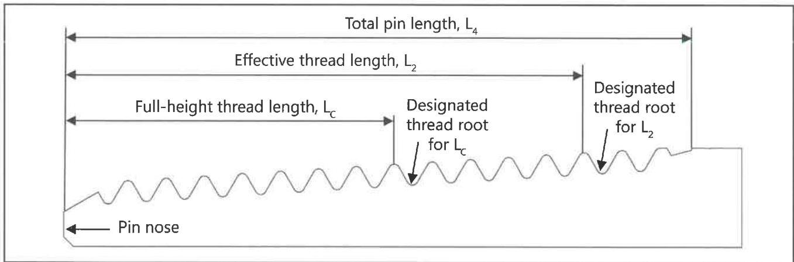

## 7.24.5 Post-Qualification Requirements

Clean and dry the entire frac sleeve, including the threaded end connections. Apply thread compound and thread protectors to the end connections. Place a 2 inch wide (±1/4 inch) white paint band around an accepted component. The paint band should be 6 inches ±1 inch from the pin shoulder. The paint band should be 6 inches ±2 inches from the box shoulder for box by box components. Using a permanent paint maker on the outer surface of the tool, write or stencil the applicable DS-1 qualification class, the date, and the name of the company that performed the inspection.

## 7.25 Visual API Round Connection Inspection

### 7.25.1 Scope

This procedure covers visual examination of new and used API round connections typically found on completions equipment that are compatible with tubing connections to evaluate the conditions of the connections.

### 7.25.2 Inspection Apparatus

a. A 12-inch metal ruler graduated in 1/64 inch increments, a calibrated pit depth gauge, a calibrated API round thread profile gauge, an OD caliper, and a calibrated white light intensity meter to verify illumination are required.
b. See section 1.7 for calibration requirements for the white light intensity meter, pit depth gauge, and profile gauge.

### 7.25.3 Preparation

a. Connections shall be clean so that no scale, mud, or lubricant can be wiped from the thread or face surfaces with a clean rag.

b. The full-height thread length (minimum length of full-crest threads), LC, of the pin connection, included in Figure 7.55, shall be measured using a metal ruler from the nose of the pin connection to the distance in Table 7.54 for a pin connection compatible with a box connection from non-upset tubing, Table 7.55 for a pin connection compatible with a box connection from externally upset tubing, or Table 7.56 for a pin connection compatible with a box connection from integral tubing. The root of the thread closest to the measured LC but not at a length less than LC shall be identified. This will be used as a reference point for the visual API round connection inspection procedure.
c. The effective thread length, L2, of the pin connection, included in Figure 7.55, shall be measured using a metal ruler from the nose of the pin connection to the distance in Table 7.54 for a pin connection compatible with a box connection from non-upset tubing, Table 7.55 for a pin connection compatible with a box connection from externally upset tubing, or Table 7.56 for a pin connection compatible with a box connection from integral tubing. The root of the thread closest to the measured L2 but not at a length less than L2 shall be identified. This will be used as a reference point for the visual API round connection inspection procedure.
d. The minimum illumination level at the inspection surface shall be 50 foot-candles. The white light intensity level at the inspection surface shall be verified:

- At the start of each inspection;
- When light fixtures change positions or intensity;
- Where there is a change in relative position of the inspected surface with respect to the light fixture;

Figure 7.55 Thread dimensions of an API round pin connection.