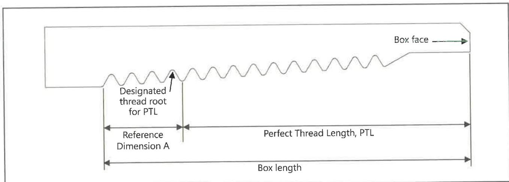

- When requested by the customer or a designated representative; and
- Upon completion of the inspection.

These requirements do not apply to direct sunlight conditions. If adjustments are required to the light intensity level at the inspection surface or if the light intensity is found to be less than 50 foot-candles when measured upon completion of the inspection, all components inspected since the most recent light intensity level verification shall be re-inspected.

### 7.25.4 Procedure and Acceptance Criteria

a. Cracks: Any cracks shall be cause for rejection for new and used pin and box connections. Grinding to remove cracks is not permitted.

b. Total Length of a Box Connection: The total length of a box connection, included in Figure 7.56, shall be measured from the box face to the last scratch farthest from the box face using the metal ruler. This measurement shall be recorded as the box length and shall meet requirements from Table 7.57 for a box connection compatible with a pin connection from non-upset tubing, Table 7.58 for a box connection compatible with a pin connection from externally upset tubing, or Table 7.59 for a box connection compatible with a pin connection from integral tubing, or the connection shall be rejected.

c. Perfect Thread Length (PTL): The Perfect Thread Length (PTL) of the box connection shall be determined by subtracting Reference Dimension A, shown in Figure 7.56, from the actual box length that was recorded in accordance with paragraph 7.25.4b. The value for Reference Dimension A is included in Table 7.57 for a box connection compatible with a pin connection from non-upset tubing, Table 7.58 for a box connection compatible with a pin connection from externally upset tubing, or Table 7.59 for a box connection compatible with a pin from integral tubing. This mathematically determined PTL shall be measured from the face of the box connection using the metal ruler. The root of the thread that is closest to the mathematically determined PTL but not at a length less than the PTL shall be identified. This will be used as a reference point for the visual API round connection inspection procedure.

d. Total Length, L4: The total length, L4, of a new or used pin connection, included in Figure 7.55, shall be measured from the pin nose using the metal ruler and shall meet requirements from Table 7.54 for a pin connection compatible with a box connection from non-upset tubing, Table 7.55 for a pin connection compatible with a box connection from externally upset tubing, or Table 7.56 for a pin connection compatible with a box connection from integral tubing, or the connection shall be rejected.

e. Full-Height Threads of New Connections: All threads between the nose of a new pin connection and the designated thread root at LC, except the thread closest to the pin nose, shall have full crests or the connection shall be rejected. All threads between the face of a new box connection and the designated thread root at the PTL, except the thread closest to the box face, shall have full crests or the connection shall be rejected. The thread profile gauge shall mesh with the thread loading and stabbing flanks so that no light is visible at any of the flanks or thread roots. Four thread profile

Figure 7.56: Thread dimensions of an API round box connection.