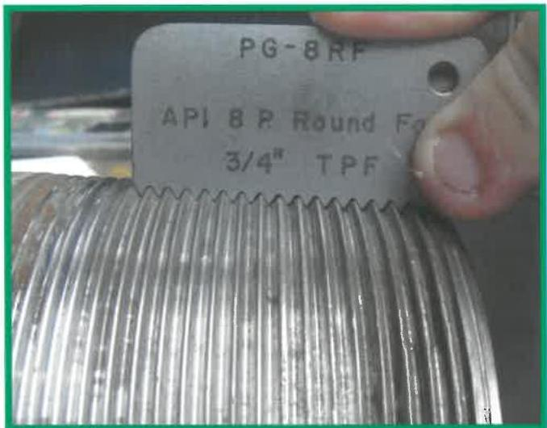
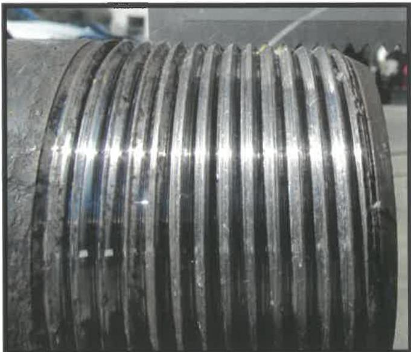
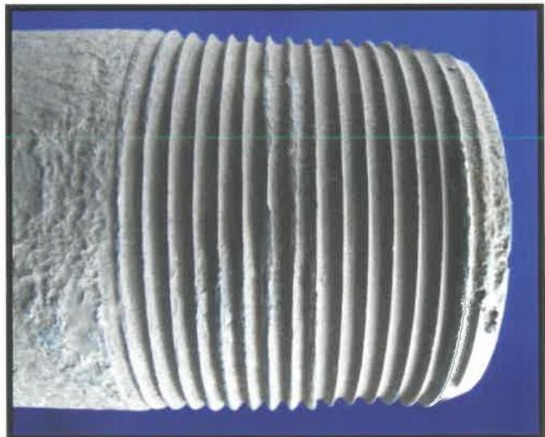

checks 90 degrees ±10 degrees apart shall be made on each connection.

f. Full-Height Threads of Used Connections: All threads between the nose of a used pin connection and the designated thread root at LC, except the thread closest to the pin nose, shall have full crests or the connection shall be rejected. All threads between the face of a used box connection and the designated thread root at the PTL, except the thread closest to the box face, shall have full crests or the connection shall be rejected. The thread profile gauge shall be used as a reference to check for major imperfections to the threads, such as raised metal, torn threads, pulled threads, or severely sharpened threads. Examples of acceptable and rejectable thread conditions are shown in Figures 7.57–7.59. Four thread profile checks 90 degrees ±10 degrees apart shall be made.

g. Damages to Threads of New Connections: All threads (including those within L4 on a pin connection and every thread on a box connection) shall be free of all pitting, or the connection shall be rejected. All threads shall be free of raised metal, torn threads, pulled threads, galling, missing threads, and other imperfections, or the connection shall be rejected. Raised protrusions shall be removed with a hand file or "soft" (nonmetallic) buffing wheel.

h. Damages to Threads of Used Connections: All threads (including those within L4 on a pin connection and every thread on a box connection) shall be free of all pitting in the thread roots or the connection shall be rejected. Threads between the pin nose and the designated thread root at LC or between the box face and the designated thread root at the PTL shall be free of raised metal, torn threads, pulled threads, or severely sharpened threads, or the connection shall be rejected. Thread surfaces within L2 on a pin connection and all threads on a box connection shall be free of imperfections, including pits, that appear to either penetrate below the thread root, occupy more than 3/4 inch in length along any thread helix, or exceed 1/32 inch in depth or 1/16 inch in diameter. Raised protrusions must be removed with a hand file or "soft" (nonmetallic) buffing wheel. The thread profile gauge shall be checked after any buffing or cleaning of the threads using the thread profile gauge. Examples of acceptable and rejectable thread conditions are shown in Figures 7.57–7.62.

i. Box Connection Dimensions of New and Used Connections: The box connection OD shall be

Figure 7.57 Acceptable thread condition.

Figure 7.58 Rejectable thread condition due to deformed threads.

Figure 7.59 Rejectable thread condition due to sharpened threads.