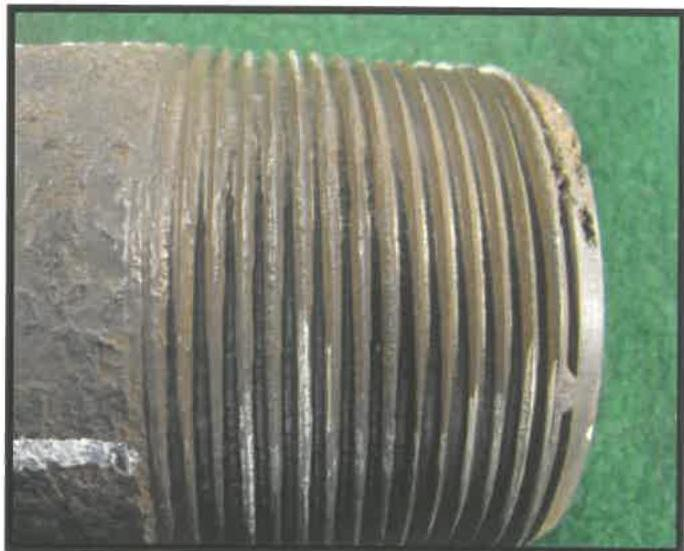
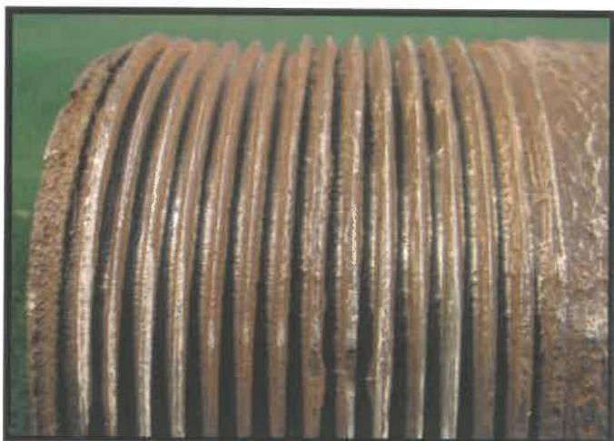
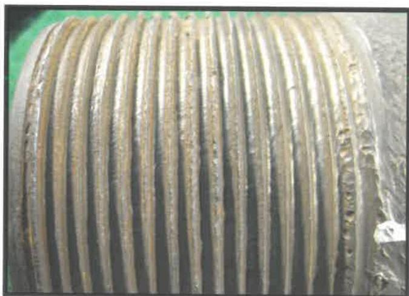
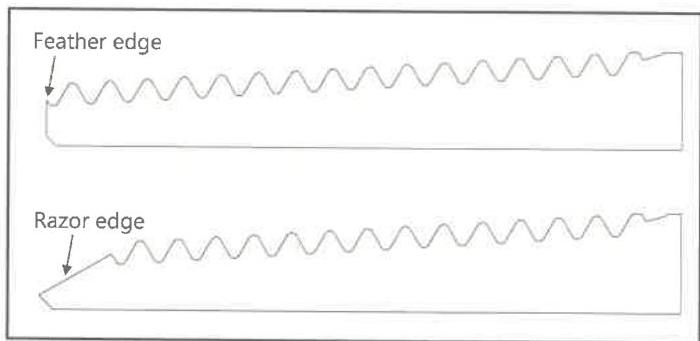

Figure 7.60 Rejectable thread condition due to pitting that exceeds 1/16 inch in diameter.

Figure 7.61 Rejectable thread condition due to imperfections that occupy more than 3/4 inch in length along a thread helix.

Figure 7.62 Rejectable thread condition due to pitting that exceeds 1/32 inch in depth.

measured for new and used connections in two locations at least $90 \pm 10$ degrees apart using the OD calipers and the metal ruler. This measurement shall be recorded and shall meet vendor requirements or, if applicable, Table 7.60 for a box connection compatible with a pin connection from non-upset tubing or externally upset tubing or Table 7.61 for a box connection compatible with a pin connection from integral tubing. A straightedge shall be placed along the longitudinal axis of the box connection OD. If a visible gap exists between the straightedge and the box connection, the OD shall also be measured in the location with the gap using the OD calipers and the metal ruler.

j. OD Imperfections of New and Used Box Connections: The depth of any pits, gouges, grip marks, or other imperfections on the OD of a new or used box connection shall be measured using the pit depth gauge. The vendor shall specify acceptance criteria for the maximum depth of any imperfections. If the vendor does not have these acceptance criteria specified, then the box connection shall be rejected if the imperfection has a depth greater than the maximum depth included in Table 7.60 for a box connection compatible with a pin connection from non-upset tubing or externally upset tubing or Table 7.61 for a box connection compatible with a pin connection from integral tubing. If a gouge has an adjacent metal protrusion, then the protrusion shall be removed prior to making a depth measurement.

k. Pin Nose Chamfer: A pin nose chamfer not present for a full (360 degree) circumference is cause for rejection. A thread root that runs out on the pin nose, a feather edge, or a knife edge (razor edge) is cause for rejection. Examples of these scenarios can be found in Figure 7.63, while a properly machined pin nose chamfer can be seen in Figure 7.55.

Figure 7.63 Rejectable features of an API (8-round) tubing pin nose.