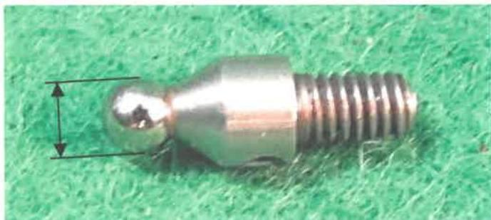

1. Dents: Dents or mashes that cause out-of-tolerance thread dimensions are cause for rejection. Any dents on the nose of a new pin connection or face of a new box connection shall be cause for rejection. Any dents on the nose of a used pin connection or face of a used box connection shall be measured using the pit depth gauge. The depth of the imperfection shall not exceed 1/8 inch for a used connection, or the connection shall be rejected.

## 7.26 Dimensional API Round Connection Inspection

### 7.26.1 Scope

This procedure covers dimensional examination of new and used API round connections typically found on completions equipment that are compatible with tubing connections to evaluate the condition of the connections.

### 7.26.2 Inspection Apparatus

a. A calibrated lead gauge and calibrated lead setting standards are required. The accuracy of the lead gauge shall be verified by applying the gauge to the appropriate lead setting standard. Prior to adjusting the lead gauge, the gauge ball diameter (shown in Figure 7.64) shall be checked with a calibrated micrometer or caliper with precision to the thousandths and shall be:

- 0.072 inch ±0.002 inch for 8-round threads, or
- 0.057 inch ±0.002 inch for 10-round threads.

See section 1.7 for calibration requirements for the gauge and each setting standard as well as the micrometer or caliper.

b. Both a calibrated external thread taper gauge and a calibrated internal thread taper gauge are required. The gauge ball diameter (shown in Figure 7.64) of the taper gauges shall be checked with a micrometer or caliper with precision to the thousandths and shall be:

Figure 7.64 Example of a gauge ball diameter.

- 0.072 inch ±0.002 inch for 8-round threads, or
- 0.057 inch ±0.002 inch for 10-round threads.

See section 1.7 for calibration requirements for the gauge as well as the micrometer or caliper.

c. A calibrated thread height gauge is required. Either a balanced-dial type gauge or a continuous-reading type gauge shall be used. If a balanced-dial type gauge is used, it shall be placed on a calibrated setting standard with the gauge ball within the notch and be set so that the dial registers zero. If a continuous-reading type gauge is used, it too shall be placed on a setting standard with the gauge ball within the notch so that the dial registers the appropriate thread height of:

- 0.071 inch ±0.001 inch for 8-round threads; or
- 0.056 inch ±0.001 inch for 10-round threads.

It is also acceptable to place the gauge ball of the continuous-reading type gauge on a flat machined surface so that the dial registers zero. See section 1.7 for calibration requirements for the gauge and the standard.

d. Both a calibrated external thread pitch diameter gauge and a calibrated internal thread pitch diameter gauge are required to measure pitch diameters unless this is done using taper gauges. The pitch diameter gauges shall be zeroed using appropriate calibrated standards, such as rod standards or frame standards. See section 1.7 for calibration requirements.

e. Each gauge shall be standardized:

- At the start of each inspection;
- After inspecting 50 connections with that gauge; and
- Upon completion of the inspection.

If upon completion of the inspection the most recent standardization accuracy cannot be verified, then all connections inspected since the most recent standardization shall be re-inspected.

f. A calibrated white light intensity meter shall be used to verify illumination. See section 1.7 for calibration requirements.

### 7.26.3 Preparation

a. Connections shall be clean so that no scale, mud, or lubricant can be wiped from the threads or any other surface with a clean rag.