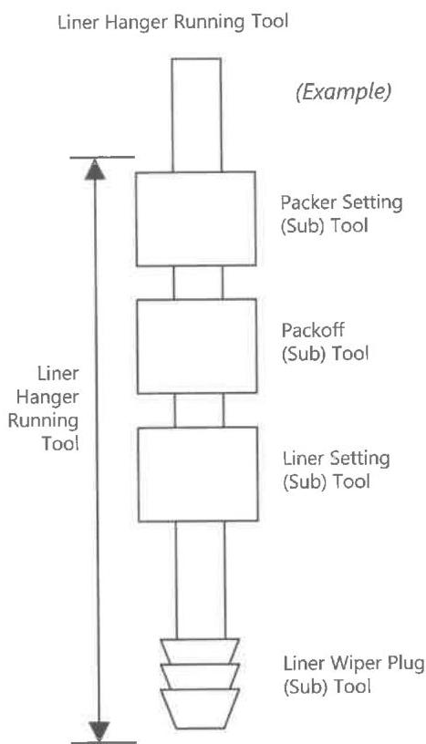

# 1. Summary

DS-1 Volume 4 is dedicated to the prevention of structural failures (that is, leaks and breaks) in specialty tools used in the upstream oil and gas market. This failure prevention work focuses on the maintenance processes for the tools as described in section 1.2, as well as the Load Capacity calculations and communication as given in Chapter 2.

# 1.1 Definitions

Specialty Tool: A device that can be attached to or run in a drill string or casing string and perform some function. It is assembled from two or more components or sub-tools. It is complete in itself, that is, no additional equipment is needed for its function except possibly some activation device (such as a pump-down plug) or some external power or pressure source.

Sub-Tool: A device made up of two or more components that may be attached to other components or sub-tools to form a specialty tool. A sub-tool is not intended to be run without further assembly.

Assembly: The process of joining all components and/or sub-tools into a working tool or sub-tool.

Competency: The demonstrable ability of a person to perform a task associated with the maintenance (inspection, assembly, or testing) of a tool or sub-tool.

Competency Standard: A written process to define the skills necessary for an individual to be considered competent, and the process used to verify and document the competency of an individual.

Component: A part or piece used in a tool or sub-tool.

Customer: The party that is in immediate economic risk in the event of a specialty tool failure. Except in a turnkey drilling situation, the customer will normally be an operating company.

Inspection: Nondestructive examination of the used components that are part of a tool or sub-tool to confirm that they are ready to be reassembled into a tool or sub-tool.

Function Testing: Simulating the exercise of the functions of a specialty tool or sub-tool, after assembly but before shipment for use.

Manufacturer: The company that is responsible for the design and manufacture of a specialty tool. It may also be called the Original Equipment Manufacturer (OEM).

Rental Tool: A tool intended to be used in performing some function, and then retrieved and used again.

Sale Tool: A tool intended to be used once and remain permanently installed.

Vendor: The party that commercially rents, leases, or sells a specialty tool to a customer and that the customer will look to in the event of a failure. A customer may secure a specialty tool from a vendor singly, in combination with other tools and equipment, or packaged with some service. The vendor assumes the responsibility as a tool owner to incorporate any design changes or safety alerts communicated by the manufacturer.

Figure 1.1 A specialty tool is assembled from two or more components and may include one or more sub-tools. A sub-tool is also assembled from two or more components, but is not intended to be run by itself.

# 1.2 Overall Coverage

This standard does not regulate the design, prototyping, or manufacturing processes that a specialty tool may undergo.