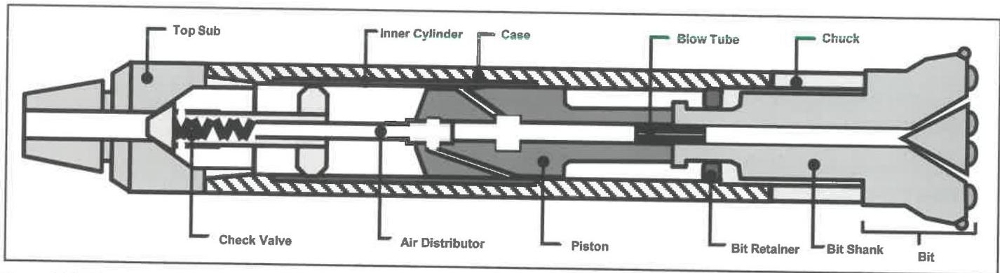

# 7.29 Specific Requirements for Shop Maintenance of Air Hammer Tools

## 7.29.1 Scope

This section provides additional specific requirements for shop inspection, assembly, and function testing of air hammers.

## 7.29.2 Preparation

The following steps must be performed to prepare for the inspection, assembly, and function testing of air hammers.

### 7.29.2.1

Record the tool serial number and tool description. Reject the tool if no serial number can be located unless the customer waives this requirement.

### 7.29.2.2

When qualifying the components to the maintenance classification A1, disassemble the tool completely, breaking all midbody connections, removing all inserts, plugs, seats, seals, and springs.

## 7.29.3 Inspection Requirements

The Inspection Program developed by the vendor for inspection of air hammers must include the following procedural requirements and common inspection methods.

### 7.29.3.1 Apparatus

The following equipment must be available for inspection: paint marker, pit gage, a light capable of illuminating the entire internal surface, metal scale, tape measure, flat file or disk grinder, and an inspection mirror. All apparatus requirements specified in the applicable common inspection methods are also required.

### 7.29.3.2 Common Inspection Methods Required

- Sub Inspection (7.12)
- Visual Connection Inspection (7.14)
- Dimensional 3 Inspection (7.16)
- Blacklight Connection Inspection (7.17)
- MPI Body Inspection (7.19)

### 7.29.3.3 Reference Diagram

To assist the inspector, Figure 7.65 diagrams an example air hammer assembly labeled with the component nomenclature referenced within this standard.

### 7.29.3.4 Visual Body and Internal Hardware Inspection

Examine all outside surfaces including but not limited to the case, chuck, top sub, piston, bit, and other components for mechanical damage. A cut, gouge, erosion, corrosion, cavitation, or similar flaw shall be cause for rejection of the component if the flaw:

a. Is deeper than 10% of the adjacent wall for tubular components such as the case and chuck.

b. Is deeper than 10% of the component thickness for odd-shaped components such as the piston and bit retainer. Thickness for odd-shaped components is defined as the smallest distance between opposite surfaces, measured at the thinnest point (see Figure 7.4).

c. Is found on any internal or external bearing surface, anvil face, or sealing surface including but not limited to the outer sealing surface of the piston, the anvil face of the piston or bit shank, the internal bearing surface of the inner cylinder or case, or the splines on the chuck or bit shank. If a new bit shank is used, a new chuck shall also be used.

Figure 7.65 Example air hammer assembly.