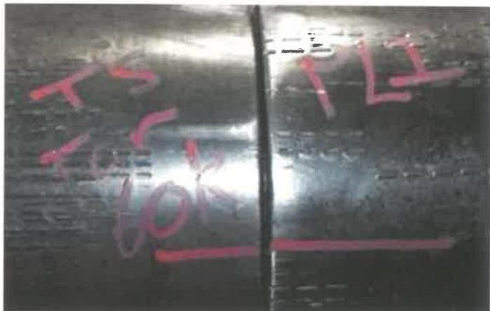
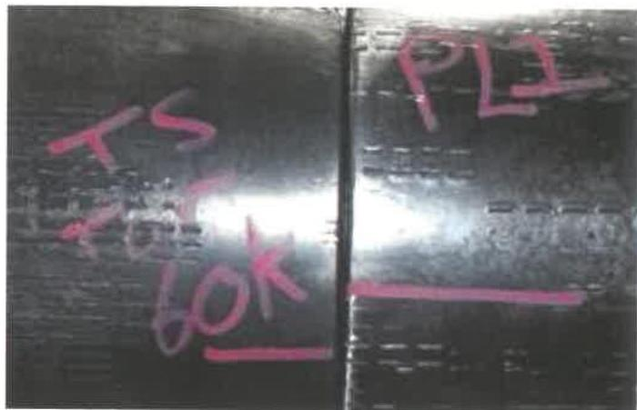
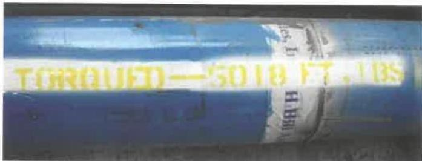
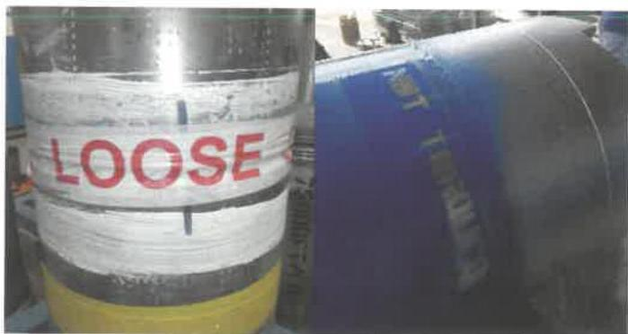

Photographs in this section provided by Chevron.

Figure 7.66 Initial scribe line.

Figure 7.67 Offset scribe line and MUT.

Figure 7.68 Final torque stripe.

Figure 7.69 Not torqued connections.

g. Documentation, including bucking equipment calibration records, torque graphs, and torque-turn and torque-time graphs shall be included in the Assembly Check Sheet.

h. Occasionally, due to operational needs, connections must be shipped to the rig that are not torqued up. When this occurs, the words “LOOSE - NOT TORQUED” must be clearly marked or stenciled across the connection on two sides, 180 degrees apart. The rig should always be made aware of the operational need to ship the connection loose. The shipping documentation should also reflect the loose connection.

## 7.31 Specific Requirements for Shop Maintenance of Elevator Links

### 7.31.1 Scope

This section provides additional specific requirements for the shop inspection of elevator links.

### 7.31.2 Preparation

The following steps must be performed to prepare for the inspection of the elevator links:

#### 7.31.2.1 Verification of Customer Requirements

Determine from the customer the required equipment tensile ratings and elevator link lengths. If any of the equipment properties do not meet the customer requirements, do not proceed with the inspection; notify the customer.

#### 7.31.2.2 Preparation of Surfaces for Inspection

a. Critical area maps for each component shall be provided by the vendor to the inspector so that the proper inspection areas can be prepared for inspection. If critical area maps are not provided by the vendor, the entire tool shall be treated as critical and inspected on 100% of its area.

b. All foreign material such as paints, coatings, dirt, grease, oil, scale, etc shall be removed from the critical areas prior to inspection. A form of grit-blasting is the preferred method for preparing equipment surfaces for inspection. However, other methods capable of completely removing the foreign material from the