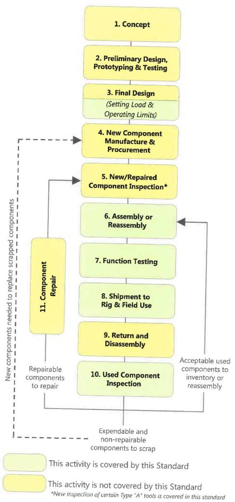

Figure 1.2 Type "A" specialty tools and sub-tools are recovered, refurbished and reused along paths similar to those shown.

DS-1 Volume 4 is focused on the maintenance of the tool, putting the appropriate processes in place to ensure a low likelihood of failure.

The maintenance cycle of a given tool generally follows these steps:

- Inspection: The components of the tool or sub-tool are subjected to various non-destructive testing to verify their fitness for further use.
- Assembly: The components of the tool or sub-tool are put together to make the tool ready for operation.
- Testing: The assembled tool is subjected to various shop testing to verify its readiness for use.
- Use: The customer places the tool in operation.
- Disassembly: The tool is returned to the shop and the components separated in preparation for inspection.

It is this maintenance cycle that Volume 4 addresses in the following chapters. Clearly, a sale tool would ideally only be subject to the Assembly, Testing, and Use portions of this cycle.

The only area outside of this maintenance process addressed by this standard is the general load rating process presented in Chapter 2. This load rating process has as its goal the clear communication of usable limits between the vendor and customer.

## 1.3 Maintenance Classifications

In order to allow the customer flexibility in which requirements of this standard are mandated in different scenarios, a "maintenance classification" system has been introduced. The customer is responsible for choosing the maintenance classification that corresponds to the level of involvement and oversight desired in the maintenance process.

Table 1.1 Coverage of this Standard

|   | Load and Operating Limits | Disassembly | New Component Inspection | Used Component Inspection | Assembly | Testing | Field Use  |
| --- | --- | --- | --- | --- | --- | --- | --- |
|  Type A Tools | X | - | X* | X | X | X | X  |
|  Type B Tools | X | - | X* | X* | X | X | -  |

*The inspection of certain Type A and Type B tools is covered in this standard.