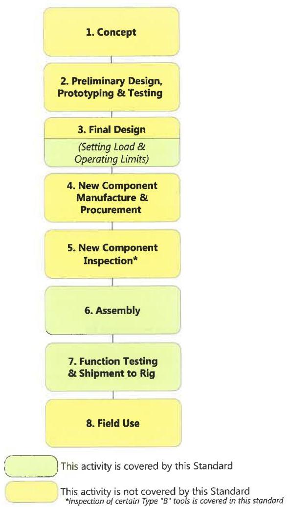

Figure 1.3 Type "B" specialty tools and sub-tools remain downhole after use along a life-path similar to this.

## 1.3.1 Tool Types

This standard labels two broad categories of specialty tools:

- Type A (Rental Tools): These tools are intended to perform some function, then to be retrieved, refurbished, and used again. Figure 1.2 shows a schematic of the typical maintenance processes involved with Type A tools, as well as the coverage provided by DS-1 Volume 4.
- Type B (Sale Tools): These tools are intended to be run once and remain permanently in service. Figure 1.3 shows a schematic of the typical maintenance processes involved with Type B tools, as well as the coverage provided by DS-1 Volume 4.

These two tool types are treated separately in the maintenance classifications defined below.

## 1.3.2 Type A Maintenance Classifications

This standard ranks Type A tools into four maintenance classes. The methods the vendor uses in refurbishing a tool immediately before it is shipped will determine the classification of that tool as it leaves the vendor's shop on its way to a rig.

- Class A1: A tool rated Class A1 will have undergone a complete overhaul since it was last returned from the field. Every component must have been separated from every other component in the disassembly process (see note below). Furthermore, the tool must have been inspected in accordance with Chapter 4 and reassembled and function tested in accordance with Chapters 5 and 6 of this standard. If the tool belongs to one of the tool families described in Table 7.1, then the tool must also meet all additional inspection, assembly, and function testing requirements listed in Chapter 7 of this standard.

Note: Complete disassembly of the tool does not require disassembly of the tool to a point where the disassembly would result in damage or destruction of the tools' components. It is also understood that some sub-tool assemblies may be treated like an integral component for the purposes of regular maintenance, but be disassembled at regular intervals for the purposes of a higher level of maintenance (battery assemblies in MWD/LWD tools are an example). The vendor is required to clearly list on every tool's or sub-tool's Bill of Materials (BOM) which sub-tools will not be disassembled as part of the regular maintenance process, and this information must be available to the customer upon request.

- Class A1/A2: If a tool or sub-tool was previously shipped as Class A1 and returned unused, it may be shipped to another job as Class A1/A2. ("Unused" means never connected to a drill string or casing string and operated or tested.) A Class A1/A2 tool may be partially disassembled and reassembled to re-configure it for a new application. Full disassembly, inspection, and reassembly is not required. However, before it is shipped, a tool classified A1/A2 shall be examined for handling damage and be function tested in accordance with Chapter 5 of this standard. If the tool belongs to one of the tool families described in Table 7.1, then the tool must also meet the additional function testing requirements listed in Chapter 7 of this standard.
- Class A3: A tool shall be designated Class A3 upon shipment to a rig if it has been used one or more