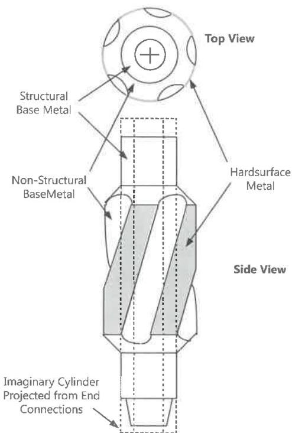
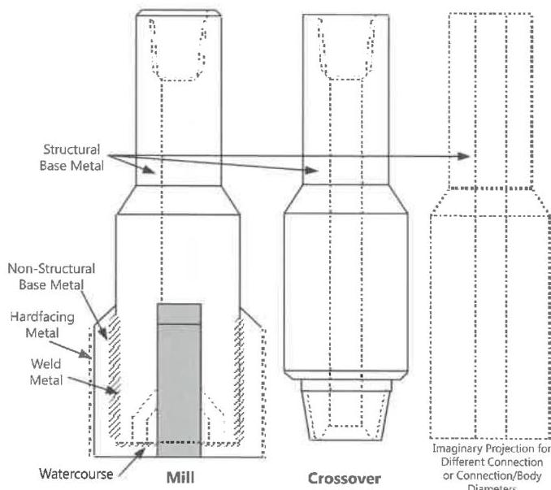
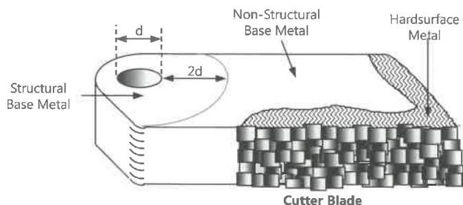

- A midbody connection that falls outside the imaginary cylinder(s) described immediately above.
- The pins or bolts that attach pinned-on or bolted-on components to a tool body.
- Portions of a tool or component that lie within two hole diameters of a pin or bolt hole, excluding hardsurface metal (Figure 7.3).
- Any other metal which, in the opinion of the inspector, meets the general definition for structural base metal in above.

b. Base Metal (Non-Structural). Metal whose failure will not result in string separation or loss of all or a significant part of a pinned-on or bolted-on component. Non-structural base metal specifically includes all metal meeting the following tests:

- A metallic component that is attached by welding to structural base metal (such as a blade on a welded-blade stabilizer or mill) but not including weld metal or hardsurface metal (Figure 7.2).
- Metal located outside a projection of a cylinder or cylinders encircling the end connection(s), unless such metal meets the requirements for structural base metal above (Figure 7.1).

c. Hardsurface Metal. Metal deposited on base metal by welding or brazing, and intended for the purpose of improving wear resistance or cutting ability of the fishing tool.

d. Other Metal. Any metal that does not clearly meet one of the definitions for base metal, weld metal, hardsurface metal, or incidental component.

e. Weld Metal. Metal deposited during a welding process for the purpose of attaching one component of a tool to another, not including hardsurface metal. Weld metal is primarily intended to provide structural support between two metallic components, neither of which is hardsurface metal (Figure 7.2).

## 7.10.2.4 Tap Wickers

Threads cut on fishing taps for the purpose of grasping the object being fished.

## 7.10.2.5 Strap Welding

The procedure of welding a strip or strips of metal across a connection to prevent inadvertent back out.

Figure 7.1 Metal classification on an example integral blade string mill.

Figure 7.2 Metal classification on example tools.

Figure 7.3 Metal classification on an example cutter blade.