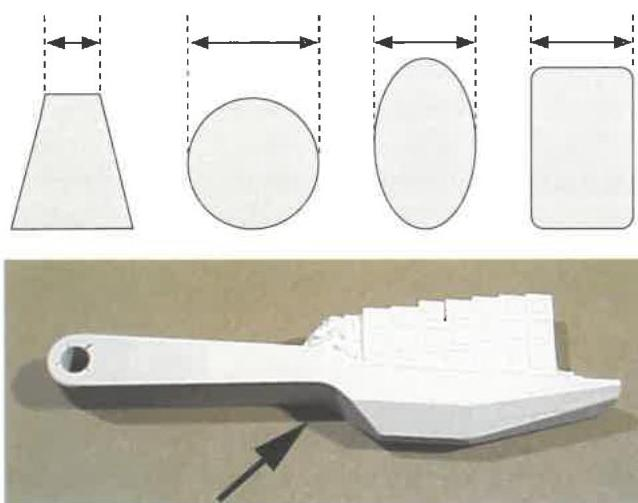
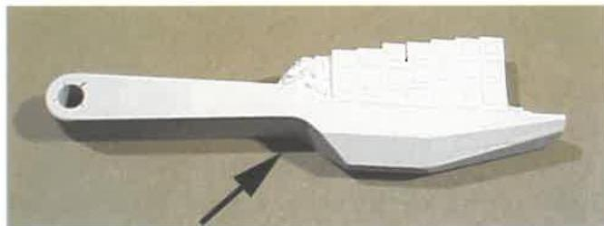
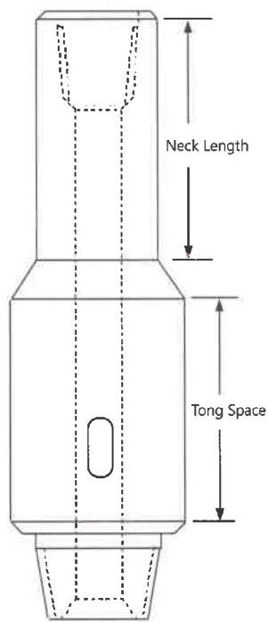

## 7.10.10 Visual/Dimensional Body Inspection

### 7.10.10.1 Cuts, Gouges, and Similar Flaws

Refer to the vendor's Inspection Procedure to determine the recommended limits for cuts, gouges, and similar flaws. Examine the outside surfaces of the tool case, arms, rollers, cutters, pins, and other components for mechanical damage. A cut, gouge, or similar flaw on structural base metal surfaces shall be cause for rejection of a component if the flaw:

a. Is deeper than 15% of the adjacent wall thickness for tubular components such as tool bodies.
b. Is deeper than 15% of the component thickness for solid components such as cutter arms. Thickness of a solid component is defined as the smallest distance between opposite surfaces, measured at the thinnest point (see Figure 7.4).
c. Is greater than 0.25 inch in depth for odd-shaped components such as rollers.
d. Exceeds the limits given in the vendor's Inspection Procedure for the tool in question.

In cases where the flaw size exceeds the limits in a. through c. above, but does not exceed the specific limits allowed in the vendor's Inspection Procedure, or no flaw size limitation is listed in the vendor's Inspection Procedure, the vendor's or manufacturer's engineering department may further evaluate and accept the flawed component, provided it does so in writing with reference to the specific flaw(s) in question. If the vendor's or manufacturer's engineering department evaluates and accepts the flaw in writing, the tool shall be accepted, and the written acceptance shall become part of the inspection report to the customer. Otherwise, the part must be rejected.

### 7.10.10.2 Neck Length on Bottleneck Fishing Subs

Bottleneck crossover subs used exclusively for fishing shall have a minimum fishing neck length of 10 inches, measured from shoulder bevel to taper, and a minimum tong space of 7 inches (see Figure 7.5). This requirement applies only to bottleneck crossover subs, since some fishing tools are designed with shorter fishing necks and tong space. Subs which will be used exclusively for rotary drilling shall meet the requirements of procedure 7.12.

### 7.10.10.3 Strap Welding

Tools that show evidence of having been strap welded shall be rejected unless this requirement is waived by the customer.

## 7.10.11 MPI Body Inspection Coverage

When performing the MPI Body Inspection (section 7.19) common inspection method, the inspection shall cover the ferromagnetic outside surfaces of tools and components, including weld areas, pins, and arms. The inspection shall be performed with an AC yoke for magnetizing and shall be done twice, with the second field oriented perpendicular to the first. Non-ferromagnetic outside surfaces shall be inspected in accordance with procedure 7.18, Liquid

Figure 7.4 Measuring the "thickness" of a solid component. Measure the smaller cross-section dimension at the point where it is thinnest.

Figure 7.5 Tong space and fishing neck length on a bottleneck fishing sub.

