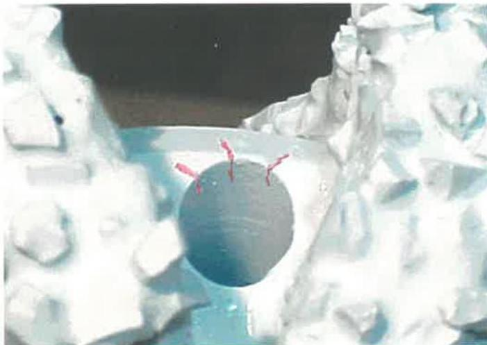
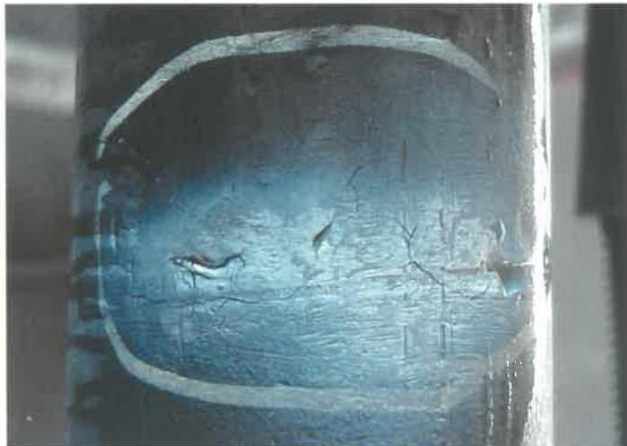
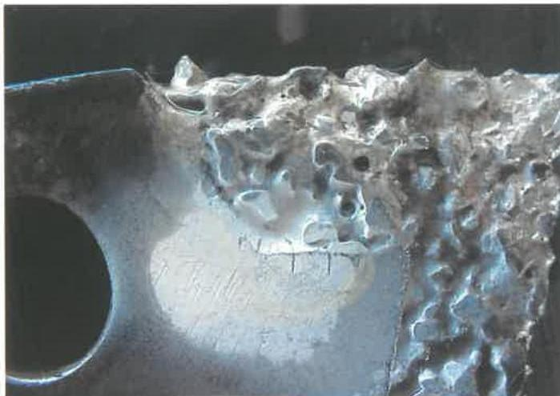
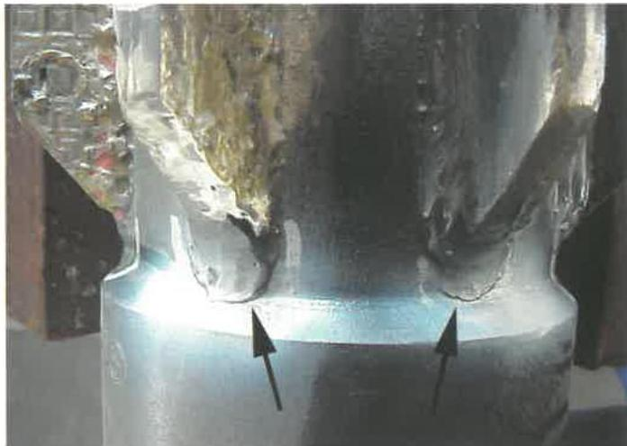
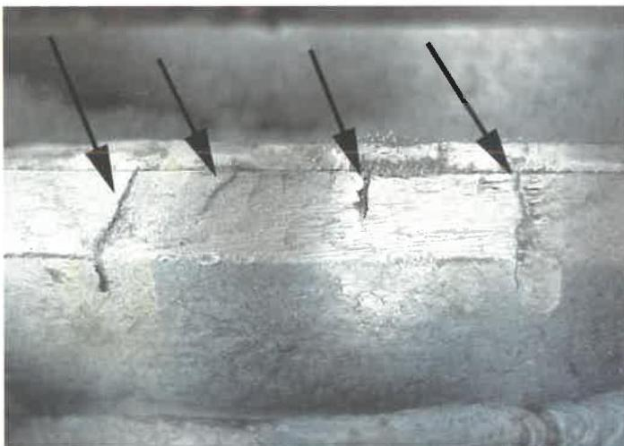
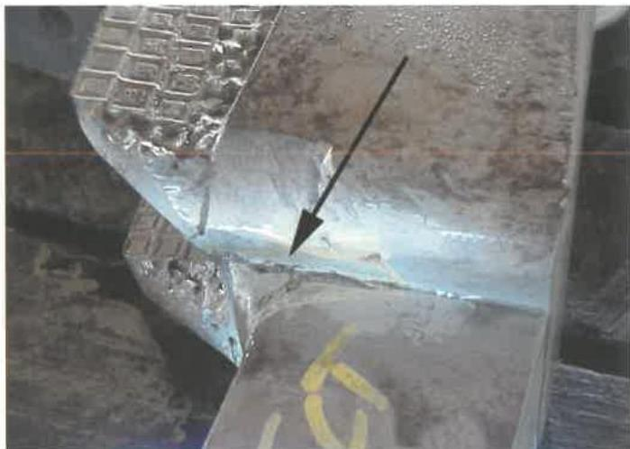

Figure 7.12 These cracks in structural base metal are acceptable because they originate in a watercourse and are smaller than the allowed length.

Photos courtesy of Weatherford International
Figure 7.13 Cracks and crack-like indications on this tool body are cause for rejecting the part, as they occur in structural base metal.

Figure 7.14 These cracks on a cutter blade are in structural base metal (within two hole diameters of the pin hole), and the component must be rejected.

Figure 7.15 Crack like indications in structural base metal on this W8 pilot mill are cause for rejection, even though the indications may be due to poor weld practice.

Figure 7.16 Rejectable cracks in non-structural base metal. Cracks are longer than 0.25 inches.

Figure 7.17 Rejectable cracks in structural base metal (arrow). Failure at this point would result in loss of a significant part of the cutter blade.

51