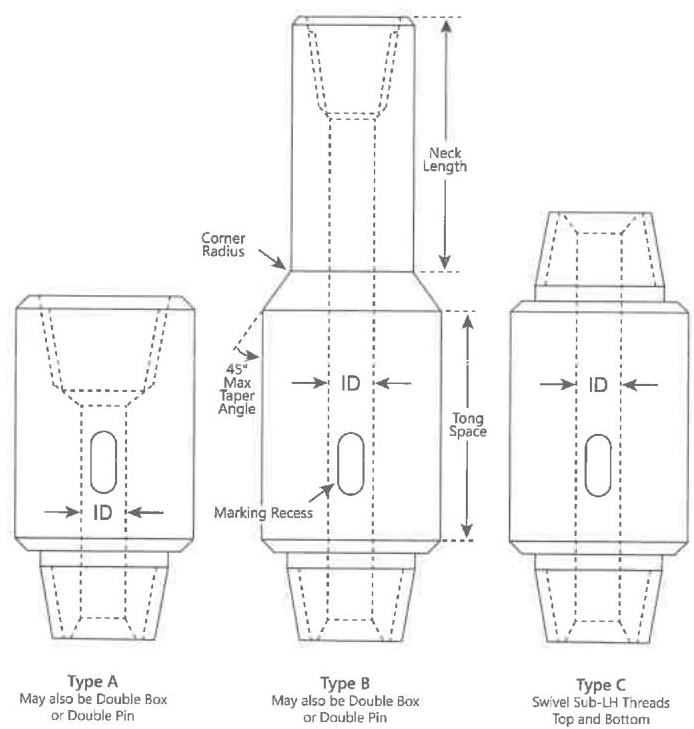

# 7.12 Sub Inspection

## 7.12.1 Scope

This procedure covers the inspection requirements and acceptance criteria for subs when used as a sub-component of drilling specialty tools. Included are both ferromagnetic and nonmagnetic components.

## 7.12.2 Preparation

Record the tool serial number and description. Reject the tool if no serial number can be located unless the customer waives this requirement.

## 7.12.3 Equipment Required

The following equipment must be available for inspection: paint marker, pit gage, a light capable of illuminating the entire internal surface, metal scale, tape measure, flat file or disk grinder. A calibrated light meter to verify illumination is also required. See section 1.7 for calibration requirements.

## 7.12.4 Common Inspection Methods Required

The following common inspection procedures must be included in the sub inspection procedure as far as they are applicable:

- Visual Connection Inspection (7.14)
- Dimensional 2 Inspection (7.15), if the sub is meant for makeup to NWDP, TWDP, or lower kelly connection

Figure 7.18 API drilling subs.

- Dimensional 3 Inspection (7.16), if the sub is used in BHA sections or is directly connected to BHA components including HWDP
- Blacklight Connection Inspection (7.17) if the sub is made from ferromagnetic material
- Liquid Penetrant Inspection (7.18) if the sub is made from nonmagnetic material
- MPI Body Inspection (7.19) if the sub is made from ferromagnetic material

## 7.12.5 Sub Dimensional Inspection

As mentioned in section 7.12.4, the sub Inspection Program requires dimensional inspection of the connections using either Dimensional 2 or Dimensional 3 Inspection method as applicable. Outlined below are some specific dimensional exceptions and additions to the requirements specified in Dimensional 2 and Dimensional 3 Inspection.

a. Inspect the connections of bit subs and subs that will join other BHA connections in accordance with procedure 7.16, Dimensional 3 Inspection, except that bevel diameters shall meet the requirements in steps b-d below, whichever applies. Box OD and pin ID measurements shall result in a BSR within the customer's specified range for bit subs and other sub connections that will join BHA components, except for connections made up to the bit or HWDP. Dimensions for commonly specified BSR ranges are given in Table 7.37. BSR values for various connection types and sizes are provided in Table 7.50.
b. Bit subs and other sub connections that will join BHA components, except HWDP: Use bevel diameters from Table 7.37.
c. Sub connections joining HWDP: Use bevel diameters from Tables 7.38–7.47, as applicable.
d. Sub connections joining bits: Use the following bevel diameter ranges:

|  Connection | Minimum | Maximum  |
| --- | --- | --- |
|  2-3/8 Reg | 3-1/32 | 3-1/16  |
|  2-7/8 Reg | 3-19/32 | 3-5/8  |
|  3-1/2 Reg | 4-3/32 | 4-1/8  |
|  4-1/2 Reg | 5-5/16 | 5-11/32  |
|  6-5/8 Reg | 7-11/32 | 7-3/8  |
|  7-5/8 Reg | 8-29/64 | 8-31/64  |
|  8-5/8 Reg | 9-17/32 | 9-9/16  |