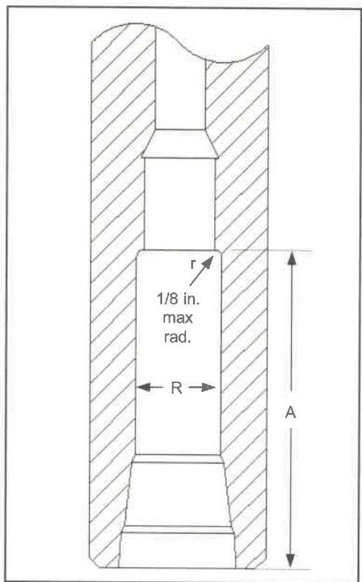

Figure 7.20 Float bore profile with baffle plate recess.

## 7.12.6 MPI Body Inspection and Liquid Penetrant Inspection Coverage

When performing the MPI Body Inspection (section 7.19) common inspection method, the inspection shall cover the entire outside diameter from shoulder to shoulder. Any crack shall be rejected. If the sub is manufactured from nonmagnetic materials, procedure 7.18, Liquid Penetrant Inspection, shall be substituted for MPI Body Inspection.

## 7.12.7 Visual Body Inspection

a. Surface Condition. Visually examine the outside surface of the sub from shoulder to shoulder for mechanical damages. Any cut, gouge, or similar imperfection on the outside surface deeper than 10% of the adjacent wall shall be rejected. The outside and inside surfaces shall be clean so that the metal surface is visible and no surface particles larger than 1/8 inch in any dimension can be broken loose. Additionally, the inside diameter(s) of the sub shall be free of any obstruction or foreign objects

b. Illumination. The minimum illumination level at the inspection surface shall be 50 foot-candles in enclosed facilities and night time. The requirement does not apply to direct daylight conditions. Inspector's compliance with training and visual acuity shall be per the competency section 1.6.

## 7.12.8 Post-Inspection Requirements

Place a 2-inch wide (±1/4 inch) white paint band around an acceptable component. The paint band should be 6 inches ±1 inch from the pin shoulder. The paint band should be 12 inches ±2 inches from the box shoulder for box × box components. Using a permanent paint marker on the outer surface of the tool, write or stencil the applicable DS-1 qualification class, the date, and the name of the company performing the inspection.

## 7.13 Stabilizer Inspection

### 7.13.1 Scope

This procedure covers the inspection requirements and acceptance criteria for stabilizers when used as a sub-component of drilling specialty tools. Included are both ferromagnetic and nonmagnetic components.

### 7.13.2 Preparation

Record the tool serial number and description. Reject the tool if no serial number can be located unless the customer waives this requirement.

### 7.13.3 Equipment Required

The following equipment must be available for inspection: Paint marker, pit gage, a light capable of illuminating the entire internal surface, metal scale, tape measure, flat file or disk grinder, stabilizer ring gauge, a calibrated light meter to verify illumination. A calibrated internal micrometer is also required. The ring gage thickness shall be 1/2 inch minimum and the gage width shall be 3/4 inch minimum. The gage inside diameter shall be the desired nominal blade diameter +0.005, -0 inch. The inside diameter of the ring gage shall be verified using the internal micrometer. See section 1.7 for calibration requirements for the light meter and micrometer.

### 7.13.4 Common Inspection Methods Required

The following common inspection procedures must be included in the stabilizer inspection procedure as far as they are applicable:

- Visual Connection Inspection (7.14)
- Dimensional 3 Inspection (7.16)
- Blacklight Connection Inspection (7.17) if the stabilizer is made from ferromagnetic material
- Liquid Penetrant Inspection (7.18) if the stabilizer is made from nonmagnetic material