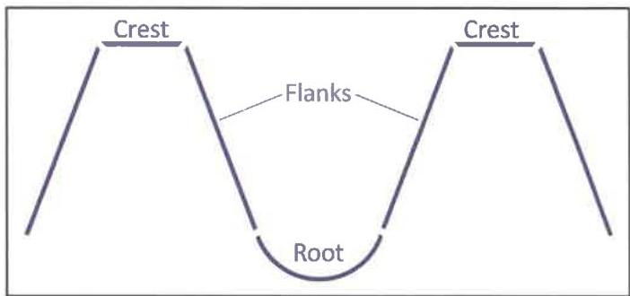
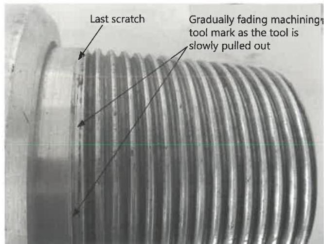

or by rubbing a metal scale or fingernail across the surface. Any pitting or interruptions of the seal surface that are estimated to exceed 1/32 inch in depth or occupy more than 20% of the seal width at any given location are cause for rejection. Metal removal below the plane of the seal surface is prohibited.

- Thread Surfaces. Thread and torque shoulder surfaces shall be free of pits or other surface imperfections that appear to exceed 1/16 inch in depth or 1/8 inch in diameter, than penetrate below the thread root, or that occupy more than 1-1/2 inches in length along any thread helix. Raised protrusions must be removed with a hand file or "soft" (nonmetallic) buffing wheel.

e. Thread Compound and Protectors. Acceptable connections shall be coated with an acceptable tool joint compound over all thread and shoulder surfaces as well as the end of the pin. Thread protectors shall be applied and secured with approximately 50 to 100 ft-lb of torque. The thread protectors shall be free of debris. If additional inspection of the threads or shoulders will be performed prior to pipe movement, the application of thread compound and protectors may be postponed until completion of the additional inspection.

## 7.14.5 API &amp; Similar Non-Proprietary Connections

In addition to the requirements of paragraph 7.14.4, API and similar non-proprietary connections shall meet the following requirements:

## 7.14.5.1 Bevel Width

An approximate 45 degree OD bevel at least 1/32 inch wide shall be present for the full circumference on both pin and box.

## 7.14.5.2 Thread Root and Surface Pitting

This criteria covers dimensional inspection of connections on components that make up to NWDP, TWDP, or lower kelly connections. (See Figure 7.21 for the thread features considered.)

a. Pin Connections: No pitting is allowed in the roots of any threads that are within 1-1/2 inches from the last scratch. Pitting is allowed in other thread roots, as well as all thread flanks and crests, as long as pitting does not occupy more than 1-1/2 inches in length along any thread helix, the pit depth does not exceed 1/32 inch, and the pit diameter does not exceed 1/8 inch.

b. Box Connections: Pitting on all thread surfaces shall not occupy more than 1-1/2 inches in length along any thread helix, the pit depth shall not exceed 1/32 inch, and the pit diameter shall not exceed 1/8 inch.

c. Locating the Last Scratch: Figure 7.22 shows an example API pin connection. The last scratch is created by the machining insert as it is slowly pulled out, leaving an imperfect thread at the back of the connection. To locate the last scratch, rotate the connection until the last mark made by the machining insert is visible.

d. Measuring Required Distance: Measure 1-1/2 inches as shown in Figure 7.23. Threads on the connection follow the thread helix. Consequently, there will be areas where some of the thread root may fall within 1-1/2 inches while some of the thread root may theoretically be outside of 1-1/2 inches from the last scratch. In such cases, no pitting is allowed on that thread root even on the portions that may theoretically lie outside of 1-1/2 inches from the last scratch.

Figure 7.21 Parts of thread forms.

Figure 7.22 Identifying last scratch on drill pipe pin connection without SRF.