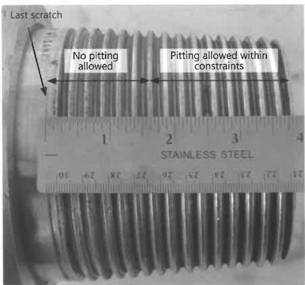
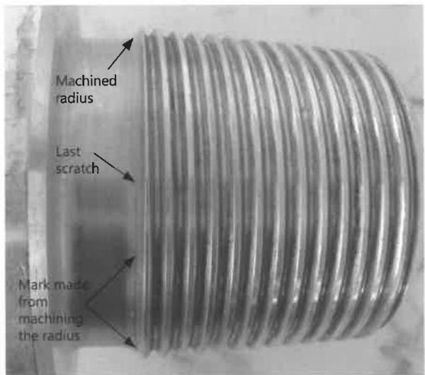
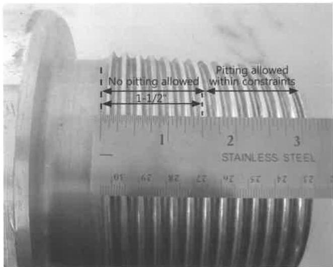
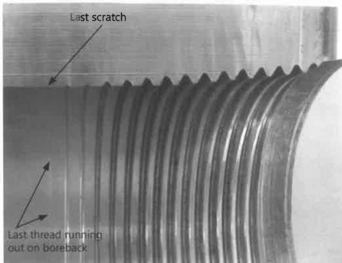
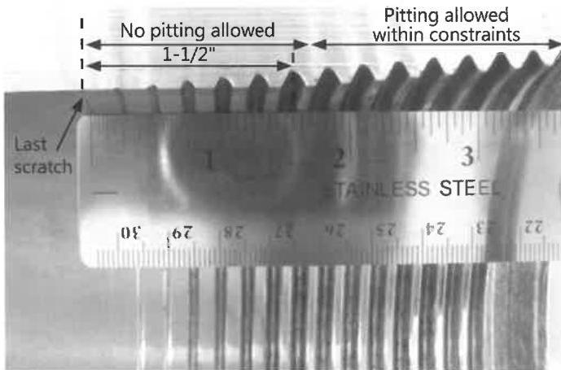
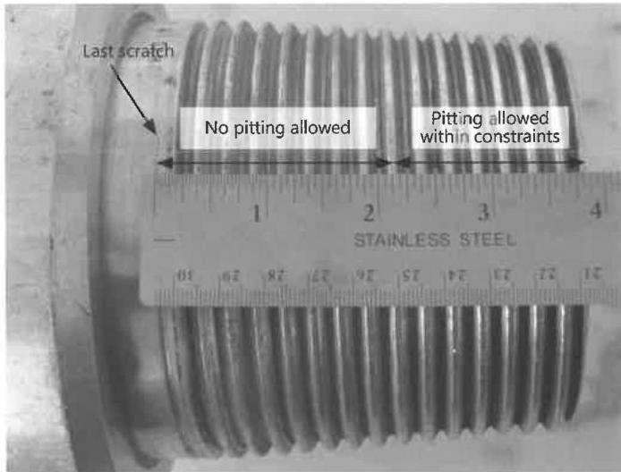

Figure 7.23 Measuring 1-1/2 inches from last scratch on drill pipe pin connection without SRF.

Figure 7.25 Locating the last scratch on BHA pin connection with SRF.

Figure 7.27 Measuring 1-1/2 inches from the last scratch on BHA pin connection with SRF.

Figure 7.24 Locating the last scratch on BHA box connection with SRF.

Figure 7.26 Measuring 1-1/2 inches from the last scratch on BHA box connection with SRF.

Figure 7.28 Measuring 2 inches from the last scratch on BHA pin connection without SRF.

59