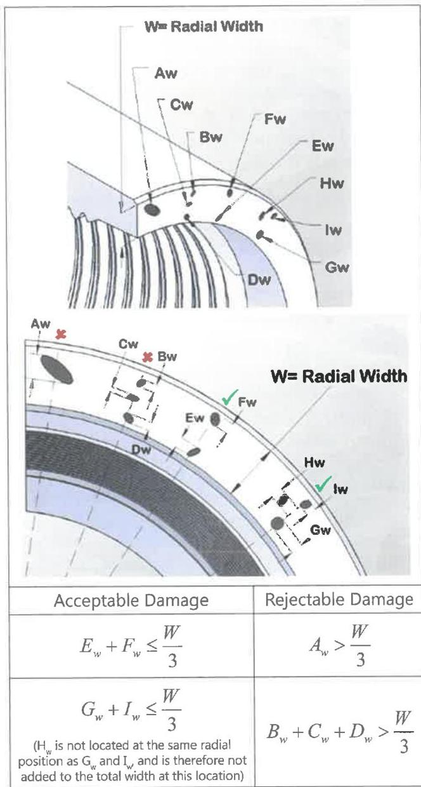

measured or visually estimated to be deeper than 1/8 inch shall be cause for rejection. Internal surfaces on equipment with a pin ID of 2 inches or smaller are exempt from being inspected. Rejectable pits in pin ID that do not contain cracks based on the results of a Liquid Penetrant or Wet Magnetic Particle inspection may be repaired in accordance with the following guidelines.

- The maximum depth of the repaired surface must not exceed 3/32 inch relative to the pin ID surface (pin ID must meet the requirements for maximum pin ID, as applicable).
- The repaired area (pit) must be blended into the surrounding pin ID over a minimum surface area that spans twice the diameter of the original pit (at its maximum dimension), but not more than three times the diameter of the original pit.
- The repaired surface must be smooth to the touch and not contain any notches or step changes.
- Repair or blending that affects tool function or performance is prohibited.

## 7.14.5.15 Shoulder Flatness

Box shoulder flatness shall be verified by placing a straightedge across a diameter of the tool joint face and rotating the straightedge at least 180 degrees along the plane of the shoulder. Any visible gaps shall be cause for rejection. The procedure shall be repeated on the pin with the straightedge placed across a chord of the shoulder surface. Any visible gaps between the straightedge and the shoulder surface shall be cause for rejection.

## 7.14.6 HI TORQUE™, eXtreme™ Torque, uXT™, eXtreme™ Torque-M, TurboTorque™, TurboTorque-M™, Grant Prideco Double Shoulder™, and uGPDS™

In addition to the requirements of paragraph 7.14.4, Grant Prideco HITORQUE™ (HT™), eXtreme™ Torque (XT™), uXT™, eXtreme™ Torque-M (XT-M™), TurboTorque™ (TT™), TurboTorque-M™ (TT-M™), Grant Prideco Double Shoulder™ (GPDS™), and uGPDS™ connections shall meet the following requirements:

NOTE: Damages include, but are not limited to, the following conditions: galls, nicks, washes, fins, dents, scratches, pits, or cuts. This does not include discoloration or other superficial anomalies that alter the appearance only. When conflicts arise between this specification and the manufacturer's requirements, the manufacturer's requirements shall apply.

a. Preparation. All thread, make-up shoulder, and seal surfaces shall be cleaned sufficiently to allow for visual inspection. For XT™, uXT™, XT-M™, TT™, and TT-M™, the starting threads of the pin and box connections should be cleaned using a soft wheel or other buffing method.

b. Primary Shoulder (Seal): The seal surfaces shall be free of raised metal or corrosion deposits detected visually or by rubbing a metal scale or fingernail across the surface. Any pitting or interruptions of the seal surface that are estimated to exceed 1/32 inch in depth or cumulatively cover more than 1/3 of the radial width at any given location are rejectable. No filing of the seal shoulders is permissible. See Figure 7.29 for examples of acceptable and rejectable damages.

Figure 7.29 Acceptable and rejectable seal damage.