c. Secondary Shoulder (Mechanical Stop): The Secondary Shoulder is not a sealing surface. Damage to this surface is not critical unless the damage interferes with the make-up, driftability, or torque capacity of the connection. Dents, scratches, and cuts are not acceptable if they exceed 1 inch in length along the circumference or cause the connection to be rejected due to shortening of the shoulder-to-shoulder length. Any metal protrusion above the seal surface is not acceptable and shall be removed by filing, soft wheel, or other buffing method and protected by applying coating to the repaired areas. Connection length readings shall not be taken in damaged areas.

d. Refacing. For HT™, XT™, uXT™, TT™, GPDS™, and uGPDS™, if refacing is necessary, the distance from the primary shoulder to the secondary shoulder must be maintained as required in the Dimensional 2 Inspection. Refacing limits are 1/32 inch on any one removal and 1/16 inch cumulatively. If existing benchmarks indicate that the shoulder has been refaced beyond the maximum, the connection shall be rejected.

- GPMark™ Benchmark. After refacing repair, a minimum length of 1/16 inch (0.062 inch) shall remain on the box refacing benchmark, and 3/16 inch maximum (0.188 inch) shall remain on the pin refacing benchmark. Rethreading is required if excess material is removed. See Figure 7.30.
- Xmark™ Benchmarks. After refacing repair, a visible step on the benchmark shall remain on the primary shoulder. The step is a necessary indicator that a benchmark is still present. Rethreading is required if there is no visible benchmark. See Figure 7.31.

Machine refacing in a lathe is the preferred method. Portable field refacing units designed specifically for Grant Prideco connections are acceptable. A minimum of four measurements shall be taken when using a portable field refacing unit. The variability of face flatness and squareness introduced shall be monitored. If any measurement is found to be outside the drawing limits, the connection shall be rejected.

e. Threads. Thread flank surfaces shall be free of damage that exceeds 1/16 inch in depth or 1/8 inch in diameter/width. For damage that is not round, the 1/8 inch requirement applies to the width of the damage, and shall not apply to the length of the damage along the circumference. See Figure 7.32.

Material that protrudes beyond the thread profile shall be removed using a round cornered triangle hand file or soft buffing wheel. Any damage in the thread roots located within the Pit Free Zone designated on the "Field Inspection Dimensions" drawing, latest revision, is not acceptable. For thread roots outside the

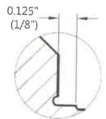

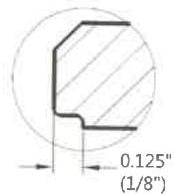
New Benchmark

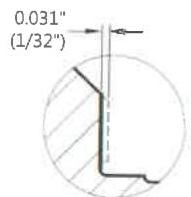

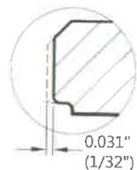
Max Removed per Reface

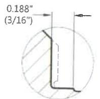

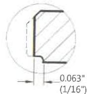
Max Reface

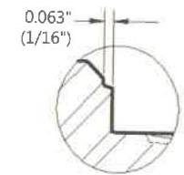

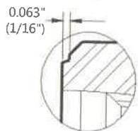
New Benchmark

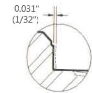

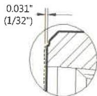
Single Reface

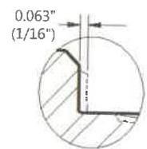

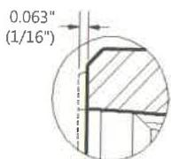
Max Reface (with visible step)

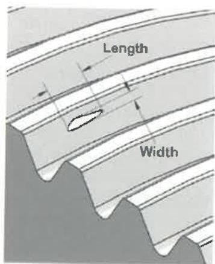
Figure 7.31 Xmark™ Benchmarks.
Figure 7.32 Dimensions of damage on thread flanks.