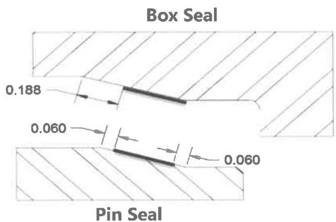

designated Pit Free Zone, damage that exceeds 1/32 inch in depth or 1/8 inch in diameter is not acceptable and shall be repaired by rethreading.

NOTE: For $XT^{\text{TM}}$, $uXT^{\text{TM}}$, $XT\text{-}M^{\text{TM}}$, $TT^{\text{TM}}$, and $TT\text{-}M^{\text{TM}}$ connections, the stab flank to crest radius of the starting 5 threads round off during break-in and normal operation. This condition is normal and does not affect the service of the connection. Thread flank surfaces that contain damage exceeding 1/16 inch in depth or 1/8 inch in diameter are acceptable in these first 5 starting threads.

f. Thread Profile. The thread profile shall be verified along the full length of complete threads in two locations at least 90 degrees apart. The profile gage shall mesh evenly in the threads and show normal contact. If the profile gage does not mesh evenly in the threads, lead measurements shall be taken.

g. Lead. For $HT^{\text{TM}}$, $XT^{\text{TM}}$, $uXT^{\text{TM}}$, $XT\text{-}M^{\text{TM}}$, $GPDS^{\text{TM}}$, and $uGPDS^{\text{TM}}$, if the profile gage indicates that thread stretch has occurred, lead shall be measured over a 2-inch interval. Thread stretch shall not exceed 0.006 inch over the 2-inch length. Connections failing this inspection should be inspected for cracks and, if none are found, re-threaded.

For Grant Prideco $TT^{\text{TM}}$ and $TT\text{-}M^{\text{TM}}$, if the profile gage indicates that thread stretch has occurred, both thread leads shall be verified individually (in lead) and jointly (between leads). Connections failing the below inspections shall be inspected for cracks and if none are found, re-threaded.

## Three Threads per Inch (3 TPI)

- The first lead shall be measured over 6 threads (2 inch interval) and shall not exceed 0.006 inch.
- By advancing one thread, the second thread lead shall be measured over 6 threads (2 inch interval) and shall not exceed 0.006 inch.
- Joint thread leads shall be measured over 5 threads (1-1/2 inch interval) and shall not exceed 0.005 inch.

## Three and a Half Threads per Inch (3.5 TPI)

- The first lead shall be measured over 4 threads (1 inch interval) and shall not exceed 0.003 inch.
- By advancing one thread, the second thread lead shall be measured over 4 threads (1 inch interval) and shall not exceed 0.003 inch.

- Joint thread leads shall be measured over 7 threads (2 inch interval) and shall not exceed 0.006 inch.

h. Coating. Threads and shoulders that are repaired by filing or refacing must be phosphate coated or copper sulfate coated.

i. Dimensional. Dimensional 2 (section 7.15.5 or 7.15.6, as applicable) is required for connections meant for make up to NWDP, TWDP, or lower kelly connections. Dimensional 3 (section 7.16.5 or 7.16.6, as applicable) is required for connections used in BHA sections or that are directly connected to BHA components including HWDP.

## 7.14.7 XT-M™ and TT-M™

In addition to the requirements of paragraph 7.14.6, Grant Prideco XT-M™ and TT-M™ connections shall meet the following requirements:

a. 15 Degree Seal. The 15 degree metal-to-metal sealing surfaces are allowed to contain non-circumferential damage that is less than or equal to 1/32 inch in length, width, diameter, or depth. Multiple pits of this type are acceptable provided there is at least 1-inch circumferential separation between them. Circumferential lines or marks are acceptable in this surface provided they cannot be detected by rubbing a fingernail across the surface. The following "Pin Seal" and "Box Seal" diagrams (Figure 7.33) show areas of the seal that may contain damage exceeding that previously stated in this procedure. The area of the pin seal within 0.060 inch of the minor pin nose diameter is a non-contact surface and damage in this area does not affect sealing. The area on the pin seal within 0.060 inch of the major pin nose diameter may also contain damage or pitting. Damages and pitting within these two areas of the pin seal are permissible

Figure 7.33 XT-M™ and TT®-M box and pin seal surfaces.