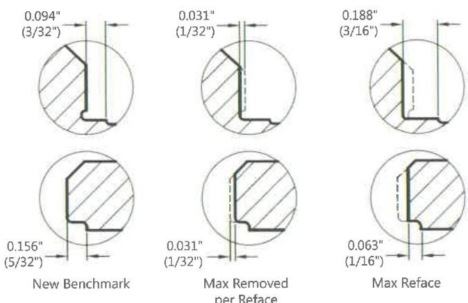
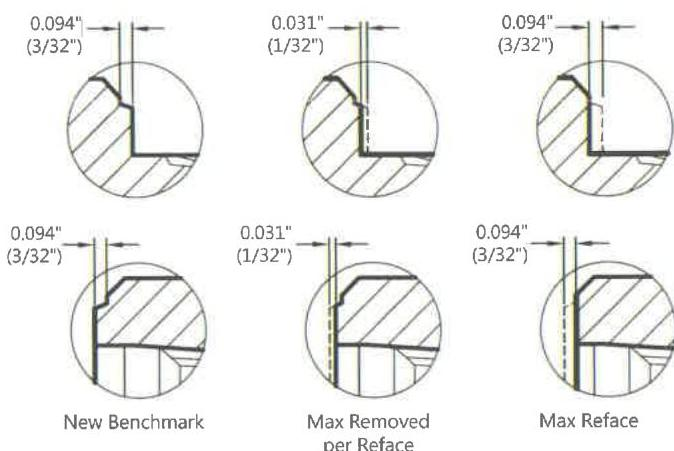

interferes with the make-up, driftability, or torque capacity of the connection. Dents, scratches, and cuts do not affect this surface unless the damage around the circumference prevents the connection length from being accurately measured at two locations approximately 180 degrees apart or there is any raised metal protruding above the seal surface that cannot be removed by filing, soft wheel, or other buffing method. (Any repaired areas shall be protected by applying an acceptable coating.)

d. Refacing: Repair by refacing may only be used to attempt to repair shoulder damage less than or equal to 3/64 inch in depth, and/or connection length discrepancies that are less than 1/32 inch out of specification.

- As is typical of the rotary-shoulder connection reface process, a maximum of 1/32 inch of material may be removed from the primary make-up shoulder during each refacing operation, after which the joint shall be placed back into service prior to performing any additional refacing repair.
- The cumulative total material removal from the primary make-up shoulder for all refacing operations shall not exceed 3/32 inch before rethreading is required.
- Repair by refacing methods shall only remove sufficient material to repair the damage. However, when damage is less than 1/32 inch deep, all damage shall be removed from the primary make-up shoulder.
- After the maximum reface allowance is met, any remaining damage on the primary make-up shoulder shall not be deeper than 1/64 inch and shall meet all other requirements of this procedure.
- If the connection cannot be brought back within the acceptable limits outlined in this procedure without removing more than 1/32 inch of material from the primary shoulder, then rethreading shall be required.
- Both the primary make-up shoulder and secondary make-up shoulder shall be skimmed/machined during a refacing operation for all double shoulder connections.
- Machine refacing in a lathe is the preferred method.
- If the portable field refacing unit method is used, the variability in the face flatness and squareness introduced shall be monitored by taking the connection length measurements in a minimum of four locations, equally spaced around the circumference. Each measurement shall be within the limits of the "Field Inspection Dimensions" drawing, latest revision.

- GPMark™ + Benchmark: After refacing repair, a minimum length of 1/16 inch (0.063 inch) shall remain on the box refacing benchmark, and 3/16 inch maximum (0.188 inch) shall remain on the pin refacing benchmark. Rethreading is required if excess material is removed. See Figure 7.34.
- Xmark™ + Benchmarks: After refacing repair, a visible step on the benchmark shall remain on the primary shoulder. The step is a necessary indicator that a benchmark is still present. Rethreading is required if there is no visible benchmark. See Figure 7.35.

Figure 7.34 Refacing with the GPMark™ + Benchmark for Delta™ connections.

Figure 7.35 Refacing with the Xmark™ + Benchmark for Delta™ connections.