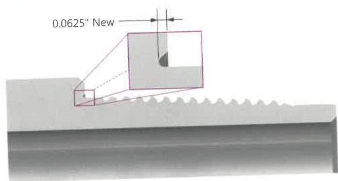
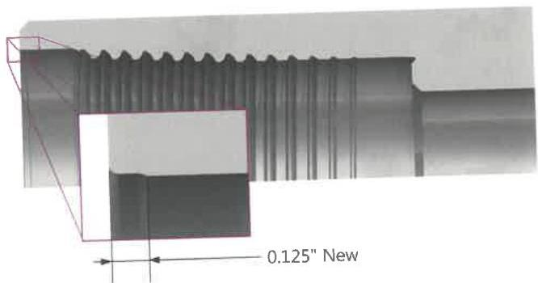

Figure 7.36 Pin end benchmark.

Figure 7.37 Box end benchmark.

When box benchmark depth is equal to or smaller than 1/16 inch, the box connection cannot be re-faced anymore. Measurement of box benchmark depth is also an indicator of how much re-facing was already carried out on the box.

g. Threads: Thread surfaces shall be free of damage that exceeds 1/16 inch in depth or 1/8 inch in diameter or that occupy more than 1-1/2 inch in length along the thread helix. Thread roots shall be free of damage that extends below the thread root radius. Material that protrudes beyond the thread profile should be removed using a round cornered triangle hand file or soft buffing wheel.
h. Thread Profile: The thread profile shall be verified along the full length of complete threads in two locations at least 90 degrees apart. The profile gage should mesh evenly in the threads and show normal contact. If the profile gage does not mesh evenly in the threads, lead measurements shall be taken.
i. Lead: If the profile gage indicates that thread stretch has occurred, lead shall be measured over a 2-inch interval. Thread stretch shall not exceed 0.006 inch over the 2-inch length.

j. Coating: X-Force™ connections should always have a phosphate coating (Mn or Zn) on both the pin and box thread and shoulder areas. If this coating is slightly worn in some areas it is acceptable, however if the coating is removed completely or if re-facing has been carried out, the connection requires re-coating with phosphate or with a Molybdenum Disulfide (MoS₂) repair kit (like Molykote® spray products).
k. Box Counterbore: The box counterbore radius shall be free of any sharp edged defects caused by poor handling or stabbing. Such defects must be removed by grinding prior to re-using the connection.

## 7.14.15 Command CET™ Connections

In addition to the Visual Connection requirements of paragraph 7.14.4, Command CET connections shall meet the following requirements.

Note: When conflicts arise between this specification and the manufacturer's requirements, the manufacturer's requirements shall apply.

a. Preparation: All thread and make-up shoulder surfaces shall be cleaned sufficiently so that no residue of any kind can be wiped from the thread or shoulder surfaces with a clean rag. For CET, the threads shall be cleaned using a "soft wheel" or other non-abrasive method on the crests (or other buffing method).
b. Primary Shoulder (Seal): The seal surface shall be free of raised metal, corrosion deposits, pitting, or interruptions that are estimated to exceed 1/32 inch in depth or occupy more than 50% of the seal width or 25% of the circumference at any given location, detected visually or by rubbing a metal scale or fingernail across the surface. Raised metal may be removed by light filing as long as existing seal surface is not impacted.
c. Secondary Shoulder (Mechanical Stop): The secondary shoulder is not a sealing surface. Damage to this surface is not critical unless the damage interferes with the make-up, driftability, or torque capacity of the connection. Dents, scratches, and cuts do not affect this surface unless they affect the primary shoulder to secondary shoulder length of the connection. Filing may be used to repair material protrusions, which extend from the face. Connection length readings shall not be taken in damaged areas.