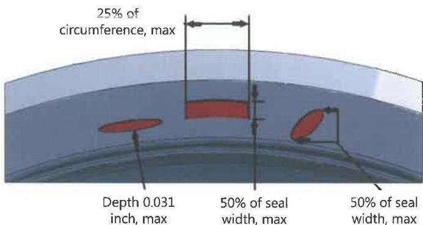

d. Refacing: If refacing is necessary, the distance from the primary shoulder to the secondary shoulder must be maintained as required in this procedure.

- Refacing limits are 1/32 inch on any one removal and 1/16 inch cumulatively. If the existing benchmarks indicate that the shoulder has been refaced beyond the maximum, the connection shall be rejected.
- Machine refacing in a lathe is the preferred method. Portable field refacing units designed specifically for CET connections are acceptable.
- During refacing, variability of face flatness and squareness may be introduced and shall be monitored. Check for squareness of the seal to the thread axis. Measure the recut seal face distance to the benchmark at two locations 90 degrees apart. If the difference is greater than 1/64 inch (0.016 inch) the connection shall be rethreaded.
- Connection lengths (pin and box) shall be verified after refacing is complete as per the criteria specified in 7.15.14g for boxes and 7.15.14j for pins.

e. Threads: Thread flank surfaces shall be free of damage that exceeds 1/16 inch in depth or 1/8 inch in diameter. Thread roots shall be free of damage that extends below the radius. Thread crests shall be free of damage that would interfere with make-up. Material that protrudes beyond the thread profile shall be removed using a round cornered triangle hand file or soft buffing wheel.

f. Thread Profile: A thread profile gauge shall be used to inspect the condition of the thread profile of both the pin and box for wear. The inspector shall look for visible light between the gauge and the thread

Figure 7.38 Acceptable and rejectable seal damage.

flanks, roots, and crest. If the visible gap between the gauge and the thread crest is greater than 0.031 inch over 4 consecutive threads, or 0.060 inch over 2 consecutive threads, the connection shall be rejected. Visible gaps between the gauge and the thread flanks estimated to be more than 0.016 inch shall be cause for rejection. Any indication of stretching shall be evaluated by measuring the lead. All stretched pins shall be inspected for cracks.

g. Lead: If the thread profile gauge indicates that thread stretch has occurred, lead shall be measured over a 2-inch interval. Thread stretch shall not exceed 0.006 inch over the 2-inch length. Connections failing this inspection shall be inspected for cracks and, if none are found, rethreaded.

h. Box Swell: A straightedge shall be placed along the longitudinal axis of the box tool joint. If a visible gap exists between the straightedge and the tool joint, the OD must be measured using calipers. Compare the OD at the bevel to the OD 2 inches, $\pm 1/2$ inch away from the bevel. If the OD at the bevel is greater by 1/32 inch or more, the connection shall be rejected.

## 7.15 Dimensional 2 Inspection

### 7.15.1 Scope

This procedure covers dimensional inspection of used rotary-shouldered connections on specialty tools meant for make up to NWDP, TWDP, or lower kelly connections.

### 7.15.2 Inspection Apparatus

a. API and Similar Non-Proprietary Connections. A 12-inch metal rule graduated in 1/64 inch increments, a metal straightedge, a calibrated hardened and ground profile gage, and ID and OD calipers are required. A calibrated lead gage and a calibrated standard lead template are also required. See section 1.7 for calibration requirements for the lead gage, lead template, and the profile gage.

b. Grant Prideco HI TORQUE™, eXtreme™ Torque, uXT™, eXtreme™ Torque-M, TurboTorque™, TurboTorque-M™, Grant Prideco Double Shoulder™, uGPDS™, and Delta™ connections. In addition to the requirements of paragraph 7.15.2a, a calibrated long stroke depth micrometer, a calibrated depth micrometer setting standards, and a calibrated extended jaw dial caliper are required. See section 1.7 for calibration requirements for the measuring