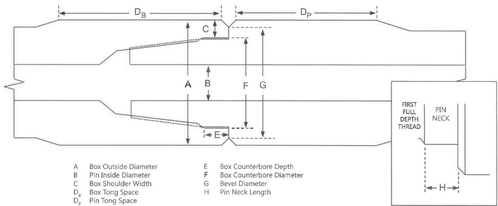

e. Box Counterbore Depth. The counterbore depth shall be measured (including any ID bevel). The counterbore depth shall not be less than 9/16 inch.

f. Box Counterbore Diameter. The box counterbore diameter shall be measured as near as possible to the shoulder (but excluding any ID bevel or rolled metal) at diameters 90 degrees ±10 degrees apart. Counterbore diameter shall not exceed the maximum counterbore dimension shown in Table 7.4, 7.29, or 7.30, as applicable.

g. Bevel Diameter. The bevel diameter on both the box and pin shall be within the minimum and maximum values given in Table 7.4, 7.29, or 7.30, as applicable.

h. Pin Neck Length. Pin neck length (the distance from the 90 degree pin shoulder to the intersection of the flank of the first full depth thread with the pin neck) shall be measured. Pin neck length shall not exceed 9/16 inch.

i. Thread Compound and Protectors. Acceptable connections shall be coated with an acceptable tool joint compound over all thread and shoulder surfaces including the end of the pin. Thread protectors shall be applied and secured with approximately 50 to 100 ft-lb of torque. The thread protectors shall be free of debris. If additional inspection of the threads or shoulders will be performed prior to pipe movement, application of thread compound and protectors may be postponed until completion of the additional inspection.

7.15.5 Procedure and Acceptance Criteria for Grant Prideco HI TORQUE™, eXtreme™ Torque, uXT™, eXtreme™ Torque-M, TurboTorque™, and TurboTorque-M™ Connections

These features are illustrated in Figure 7.40. In addition to the Visual Connection requirements of 7.14.6 and 7.14.7, as applicable, Grant Prideco HI TORQUE™, eXtreme™ Torque, uXT™, eXtreme™ Torque-M, TurboTorque™, and TurboTorque-M™ connections shall meet the following requirements:

Note: When conflicts arise between this specification and the manufacturer's requirements, the manufacturer's requirements shall apply.

a. Box Outside Diameter (OD): For Grant Prideco HI TORQUE™ and eXtreme™ Torque-M connections, the OD of the tool joint box shall be measured at a distance of 2 inches ±1/4 inch from the primary make-up shoulder. Measurements shall be taken around the circumference to determine the minimum diameter. This minimum box diameter shall meet the requirements in Table 7.5, 7.7, or 7.31, as applicable.

For Grant Prideco eXtreme™ Torque and uXT™ sizes 43 and smaller (e.g. XT43), the OD of the tool joint box shall be measured at a distance of 5/8 inch ±1/4 inch from the primary make-up shoulder. For sizes 46 and larger, the OD of the tool joint box shall be measured at a distance of 2 inches ±1/4 inch from the primary make-up shoulder. Measurements shall be taken around the circumference to determine the minimum diameter. This minimum box diameter

Figure 7.39 Tool joint dimensions for API and similar non-proprietary connections.