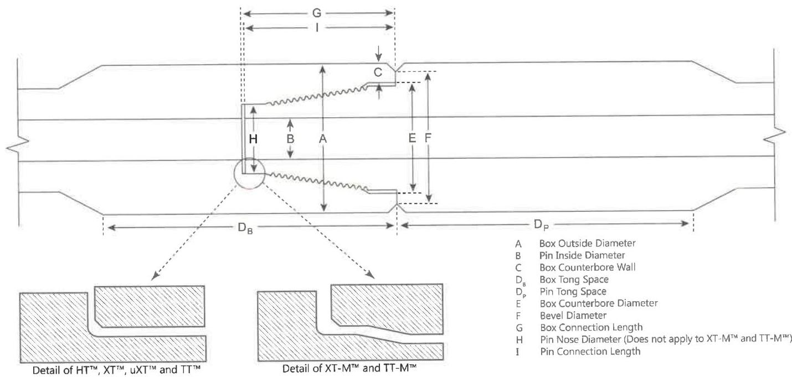

shall meet the requirements in Table 7.6, 7.11, 7.32, or 7.35, as applicable.

For Grant Prideco TurboTorque™ and TurboTorque-M™ connections, the OD of the tool joint box shall be measured at a distance of 5/8 inch to 7/8 inch from the primary make-up shoulder. Measurements shall be taken around the circumference to determine the minimum diameter. This minimum box diameter shall meet the requirements in Table 7.9–7.10, or 7.33–7.34, as applicable.

b. Pin Inside Diameter (ID). The pin ID shall be measured under the last thread nearest the shoulder (±1/4 inch) and referenced against the values in Table 7.5–7.7, 7.9–7.11, or 7.31–7.35, as applicable. The pin ID is used to define other inspection dimensions.

c. Box Counterbore (CBore) Wall Thickness. The box CBore wall thickness shall be measured by placing the straightedge longitudinally along the tool joint, extending past the shoulder surface, and then measuring the wall thickness from this extension to the counterbore. The CBore wall thickness shall be measured at its point of minimum thickness. Any reading that does not meet the minimum CBore wall thickness requirement in Table 7.5–7.7, 7.9–7.11, or 7.31–7.35, as applicable, shall cause the tool joint to be rejected.

d. Tong Space. Box and pin tong space (including the OD bevel) shall meet the requirements of Table 7.5–7.7, 7.9–7.11, or 7.31–7.35, as applicable. Tong space measurements on hardfaced components shall be made from the primary shoulder face to the edge of the hardfacing.

e. Box Counterbore Diameter. The box counterbore diameter shall be measured at two locations 90 degrees apart and shall meet the requirements shown in Table 7.5–7.7, 7.9–7.11, or 7.31–7.35, as applicable. If the diameter exceeds these limits, the connection shall be repaired by rethreading.

f. Bevel Diameter. The bevel diameter on both the box and pin shall be measured and shall meet the requirements shown in Table 7.5–7.7, 7.9–7.11, or 7.31–7.35, as applicable.

g. Box Connection Length. The distance between the primary and secondary make-up shoulders shall be measured in two locations, 180 degrees apart, and be free from mechanical damage. This distance shall meet the requirements of Table 7.5–7.7, 7.9–7.11, or 7.31–7.35, as applicable. Refer to 7.15.5k for repair of connection length non-conformances.

h. Pin Nose Diameter. For HT™, XT™, uXT™, TT™ connections, the outside diameter of the pin nose shall be measured at two locations 90 degrees apart

Figure 7.40 Tool joint dimensions for Grant Prideco HI TORQUE™, eXtreme™ Torque, uXT™, XT-M™, TurboTorque™, TurboTorque-M™, and Delta™ connections.