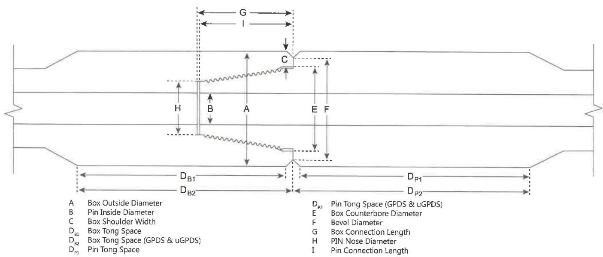

7.8 or 7.12, as applicable. The pin ID is used to define other inspection dimensions.

c. Box Shoulder Width (also referred to as Box Counterbore (CBore) Wall Thickness). The box shoulder width shall be measured by placing the straightedge longitudinally along the tool joint, extending past the shoulder surface, and then measuring the shoulder thickness from this extension to the counterbore. The shoulder width shall be measured at its point of minimum thickness. Any reading that does not meet the minimum shoulder width requirement in Table 7.8 or 7.12, as applicable, shall cause the tool joint to be rejected.

d. Tong Space. Box and pin tong space (including the OD bevel) shall meet the requirements of Table 7.8 or 7.12, as applicable. Tong space measurements on hardfaced components shall be made from the primary shoulder face to the edge of the hardfacing.

e. Box Counterbore Diameter. The box counterbore diameter shall be measured at two locations 90 degrees apart and shall meet the requirements shown in Table 7.8 or 7.12, as applicable. If the diameter exceeds these limits, the connection shall be repaired by rethreading.

f. Bevel Diameter. The bevel diameter on both the box and pin shall be measured and shall meet the requirements shown in Table 7.8 or 7.12, as applicable.

g. Box Connection Length. The distance between the primary and secondary make-up shoulders shall be measured in two locations, 180 degrees apart, and be free from mechanical damage. This distance shall meet the requirements of Table 7.8 or 7.12, as applicable. Refer to 7.15.6k for repair of connection length non-conformances.

h. Pin Nose Diameter. The outside diameter of the pin nose shall be measured at two locations 90 degrees apart and shall meet the requirements shown in Table 7.8 or 7.12, as applicable.

i. Pin Connection Length. The distance between the primary and secondary make-up shoulders shall be measured in two locations, 180 degrees apart, and be free from mechanical damage. This distance shall meet the requirements of Table 7.8 or 7.12, as applicable. Refer to 7.15.6k for repair of connection length non-conformances.

j. Thread Compound and Protectors. Acceptable connections shall be coated with an acceptable tool joint compound over all thread and shoulder surfaces including the end of the pin. A copper-based thread compound is recommended. Thread protectors shall be applied and secured with approximately 50 to 100 ft-lb of torque. The thread protectors shall be free of debris. If additional inspection of the threads or shoulders will be performed prior to pipe movement, application of

Figure 7.41 Tool joint dimensions for Grant Prideco Double Shoulder™, uGPDS™, Express™, EIS™, TM2™, X-Force™, and Command CET™ connections.