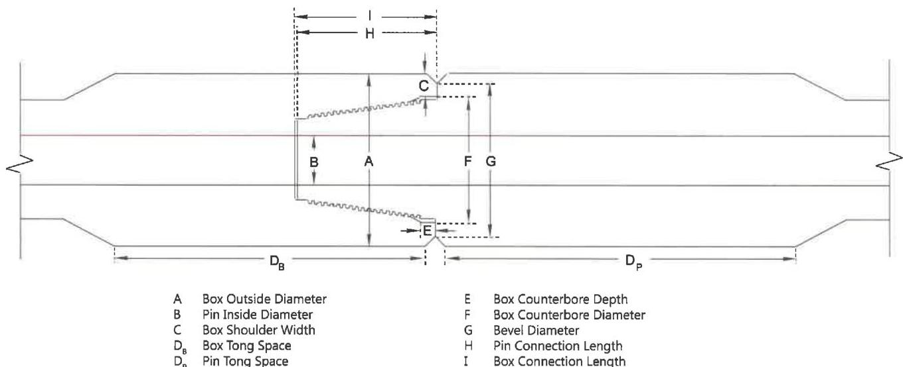

Note: When conflicts arise between this specification and the manufacturer's requirements, the manufacturer's requirements shall apply.

a. Box Outside Diameter (OD). The OD of the box connection shall be measured 2 inches ±1/4 inch from the shoulder. At least two measurements shall be taken spaced at intervals of 90 degrees ±10 degrees. Box OD measurements are for reference data only.

b. Pin Inside Diameter (ID). The pin ID shall be measured under the last thread nearest the shoulder (±1/4 inch). Pin ID measurements are for reference data only.

c. Tong Space. Box and pin tong space (excluding the OD bevel) shall meet the requirements of Table 7.23, as applicable. Tong space measurements on hardfaced components shall be made from the bevel to the edge of the hardfacing.

d. Box Counterbore Diameter. Measure the counterbore diameter at the face of the box, D1, and the counterbore diameter immediately behind the large step thread, D2. Measurements shall be taken at diameters 90 degrees ±10 degrees apart. Counterbore diameter shall not exceed the maximum counterbore dimension shown in Table 7.23.

e. Thread Compound and Protectors. Acceptable connections shall be coated with an acceptable tool joint compound over all thread and shoulder surfaces including the end of the pin. Thread protectors shall be applied and secured with approximately 50 to 100 ft-lb of torque. The thread protectors shall be free of debris. If additional inspection of the threads or shoulders will be performed prior to pipe movement, application of thread compound and protectors may be postponed until completion of the additional inspection.

## 7.15.9 Procedure and Acceptance Criteria for NK DSTJ™ Connections

These features are illustrated in Figure 7.43. In addition to the visual connection requirements of 7.14.10, NK DSTJ™ connections shall meet the following requirements:

Note: When conflicts arise between this specification and the manufacturer's requirements, the manufacturer's requirements shall apply.

a. Box Outside Diameter (OD). The OD of the tool joint box shall be measured approximately 1 inch from the shoulder. At least two measurements shall be taken spaced at intervals of 90 degrees ±10 degrees. Box OD shall meet the requirements in Table 7.18.

b. Pin Inside Diameter (ID). The pin ID shall be measured approximately 1 inch from the shoulder and shall meet the requirements of Table 7.18.

c. Box Shoulder Width. The box shoulder width shall be measured by placing the straightedge longitudinally along the tool joint, extending past the shoulder surface, and then measuring the shoulder thickness from this extension to the counterbore (excluding any ID bevel). The shoulder width shall be measured at its

Figure 7.43 Tool joint dimensions for NK DSTJ™ connection.