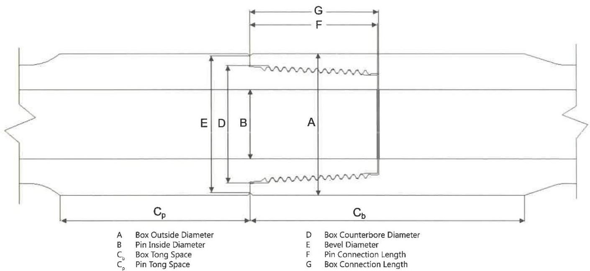

free from mechanical damage. This distance shall meet the requirements of Tables 7.19–7.22, as applicable. If the connection length exceeds the specified criteria, repair may be made by refacing the secondary shoulder (pin nose). If the connection length is less than the specified criteria, refacing the primary shoulder may be adequate to repair the connection. Refacing limits are the same as for damaged shoulder faces.

g. Box Connection Length. The distance between the primary and secondary make-up shoulders shall be measured in two locations, 180 degrees apart, and be free from mechanical damage. This distance shall meet the requirements of Tables 7.19–7.22, as applicable. If the connection length exceeds the specified criteria, repair may be made by refacing the primary shoulder. If the connection length is less than the specified criteria, refacing the secondary shoulder may be adequate to repair the connection. Refacing limits are the same as for damaged shoulder faces.

h. Thread Compound and Protectors. Acceptable connections shall be coated with an acceptable tool joint compound over all thread and shoulder surfaces including the end of the pin. A copper-based thread compound is recommended. Thread protectors shall be applied and secured with approximately 50 to 100 ft-lb of torque. The thread protectors shall be free of debris. If additional inspection of the threads or

shoulders will be performed prior to pipe movement, application of thread compound and protectors may be postponed until completion of the additional inspection.

i. Rethreading. This method shall be used to repair connections that fail to meet the requirements stipulated in this inspection procedure after field repair is completed. Performance of this operation requires cropping the connection behind any fatigue crack. Complete removal of the thread profile is not necessary if the connection has no fatigue cracks and if sufficient material can be removed to comply with the NEW product requirements. In this case, the connection does not have to be “reblanked,” however all torque shoulders, seal surfaces, and thread elements must be machined to 100% “bright metal.” This is not necessary for cylindrical diameters. After rethreading, the connection must be phosphate coated. Copper sulfate is not an acceptable substitute for phosphate coating on rethreaded connections.

## 7.15.11 Procedure and Acceptance Criteria for DP-Master DPM-DS, DPM-MT®, DPM-ST®, and DPM-HighTorque Series Connections

These features are illustrated in Figure 7.45. In addition to the Visual Connection requirements of 7.14.12, connections shall meet the following requirements.

Figure 7.44 Tool joint dimensions for Hilong HLIDS, HLMT, HLST, and HLIST connections.