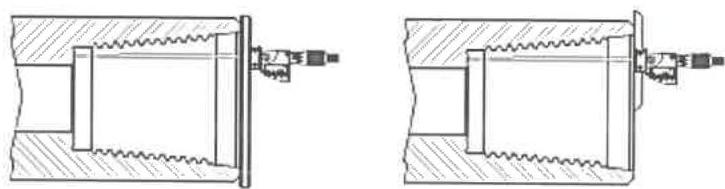
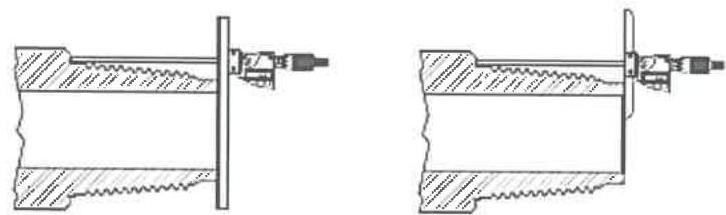

in two locations 180 degrees apart. (See Figure 7.46 for details.) Field refacing is allowed but not recommended. Machine shop refacing is preferred. Refacing limits are the same as for repair of damaged shoulders. Both the primary seal and the secondary shoulder shall be refaced simultaneously to ensure that proper connection length is maintained. The box connection length must meet the requirements in Tables 7.24–7.27, as applicable.

h. Pin Nose Diameter: The outside diameter of the pin nose shall be verified. To test for pin nose swell, the pin nose diameter must meet the requirements in the Tables 7.24–7.27, as applicable.

i. Pin Connection Length: Measurements shall be taken using the digital depth micrometer/gauge or digital vernier gauge fitted with a wide depth base attachment. The distance between the primary and secondary makeup shoulders shall be verified in two locations 180 degrees apart. (See Figure 7.47 for details.) Field refacing is allowed but not recommended. Machine shop refacing is preferred. Refacing limits are the same as for repair of damaged shoulders. Both the primary seal and the secondary shoulder shall be refaced simultaneously to ensure that proper connection length is maintained. The pin connection length must meet the requirements in Tables 7.24–7.27, as applicable.

j. Protecting Connection Post Inspection: The connections shall be coated with storage compound after inspection to avoid corrosion unless the drill pipe is run immediately. Appropriate thread protectors that cover the whole connection shall be fitted to prevent accidental impacts from foreign objects.

k. Lathe Style Rethreading and Refacing: This method shall be used to repair connections that fail to meet the requirements stipulated in this inspection procedure after field inspection is completed. This operation shall be performed by a competent and approved repair facility.

## 7.15.12 Procedure and Acceptance Criteria for Grant Prideco Delta™ Connections

These features are illustrated in Figure 7.40. In addition to the Visual Connection requirements of 7.14.13, the Grant Prideco Delta™ connections shall meet the following requirements.

NOTE: When conflicts arise between this specification and the manufacturer’s requirements, the manufacturer’s requirements shall apply.

a. Box Outside Diameter (OD): The OD of the tool joint box shall be measured at a distance 5/8 inch (±1/4 inch) from the primary make-up shoulder. Measurements shall be taken around the circumference to determine the minimum diameter. This minimum box diameter shall meet the requirements in Table 7.16 or 7.36, as applicable.

b. Pin Inside Diameter (ID): The pin ID shall be measured under the last thread nearest to the shoulder (±1/4 inch) and referenced against the values in Table 7.16 or 7.36, as applicable. The pin ID is used to define other inspection dimensions.

c. Box Counterbore (CBore) Wall Thickness: The box CBore wall thickness shall be measured by placing the straightedge longitudinally along the tool joint, extending past the shoulder surface, and then measuring the wall thickness from this extension to the counterbore. The CBore wall thickness shall be measured at its point of minimum thickness. Any reading that does not meet the minimum CBore wall thickness requirement in Table 7.16 or 7.36, as applicable, shall cause the tool joint to be rejected.

d. Tong Space: Box and pin tong space (including the OD bevel) shall meet the requirements of Table 7.16 or 7.36, as applicable. Tong space measurements on hardfaced components shall be made from the primary shoulder face to the edge of the hardfacing.

Figure 7.46 Two Methods of box connection length inspection.

Figure 7.47 Two Methods of pin connection length inspection.